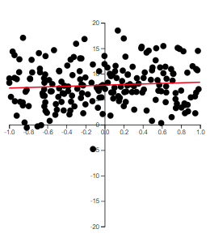
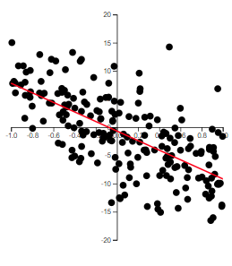
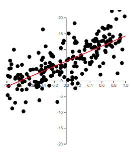
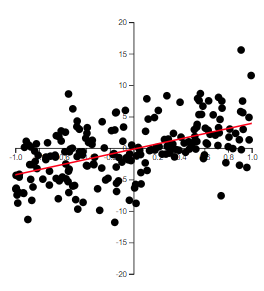

# Correlation Coefficient and the Coefficient of Determination

> 

Correlation and the coefficient of determination are two common ways to summarize the strength of a linear relationship. Both are connected to the least squares line, but they answer slightly different questions.

In this chapter, we will focus on:

1. the correlation coefficient $r$,
2. the population correlation coefficient $\rho$,
3. the relationship between correlation and the least squares slope, and
4. the coefficient of determination, $r^2$.

## The Coefficient of Correlation

The claim is often made that the crime rate and the unemployment rate are "highly correlated." Another popular belief is that IQ and academic performance are correlated. Some people even claim that the Dow Jones Industrial Average and the length of fashionable skirts are correlated.

The term *correlation* implies a relationship or association between two variables. In regression, we are especially interested in whether that relationship is approximately linear.

For data $(x_i,y_i)$, $i=1,\ldots,n$, we want a measure of how strongly $x$ and $y$ move together in a linear way.

Recall the quantities $SS_{xx}$, $SS_{yy}$, and $SS_{xy}$.

::: {.callout-note}
## Review: Different $SS$ quantities

Recall that
$$
\begin{align*}
SS_{xx} &= \sum (x_i-\bar{x})^2\\
SS_{yy} &= \sum (y_i-\bar{y})^2\\
SS_{xy} &= \sum (x_i-\bar{x})(y_i-\bar{y}).
\end{align*}
$$

:::

$SS_{xx}$ and $SS_{yy}$ measure the variability of $x$ and $y$ separately. They describe how much each variable varies around its own mean.

$SS_{xy}$ measures how $x$ and $y$ vary together.

::: {#exm-5_1 .example title="Computing sums of squares from a small dataset"}

Consider the data from @tbl-table2_1. We can find $SS_{xx}$, $SS_{yy}$, and $SS_{xy}$ in R.

```{r}
#| message: false
#| warning: false

library(tidyverse)

x <- c(1, 2, 2.75, 4, 6, 7, 8, 10)
y <- c(2, 1.4, 1.6, 1.25, 1, 0.5, 0.5, 0.4)

dat <- tibble(x, y)

ybar <- mean(y)
xbar <- mean(x)

ggplot(data = dat, aes(x = x, y = y)) +
  geom_point() +
  xlim(0, 10) +
  ylim(0, 2) +
  geom_hline(yintercept = ybar, col = "red") +
  geom_vline(xintercept = xbar, col = "red")
```

The vertical red line marks $\bar{x}$, and the horizontal red line marks $\bar{y}$.

```{r}
#| message: false
#| warning: false

dev_x <- x - xbar
dev_y <- y - ybar
dev_xy <- dev_x * dev_y

dat1 <- tibble(
  x,
  y,
  dev_x_squared = dev_x^2,
  dev_y_squared = dev_y^2,
  dev_xy
)

knitr::kable(dat1, digits = 3)
```

In the output, `dev_x_squared` represents $(x_i-\bar{x})^2$, `dev_y_squared` represents $(y_i-\bar{y})^2$, and `dev_xy` represents $(x_i-\bar{x})(y_i-\bar{y})$.

We can calculate the sums:

```{r}
# SS_xx
sum(dev_x^2)

# SS_yy
sum(dev_y^2)

# SS_xy
sum(dev_xy)
```

For these data, $SS_{xy}$ is negative. This happens because smaller values of $x$ tend to occur with larger values of $y$, and larger values of $x$ tend to occur with smaller values of $y$. That is the numerical fingerprint of a negative linear association.

:::

::: {#exm-5_2 .example title="The `trees` dataset and positive co-variation"}

For another example, consider the `trees` dataset.

In R, the `datasets` package includes several built-in datasets. One of them is `trees`.

```{r}
#| message: false
#| warning: false

library(datasets)
head(trees)
```

There are 31 observations in this dataset. The variables are:

- `Girth`: tree diameter, measured in inches at 54 inches above the ground,
- `Height`: tree height, measured in feet,
- `Volume`: timber volume, measured in cubic feet.

Suppose we want to predict `Volume` from `Girth`.

Again, we plot the data with red lines representing $\bar{x}$ and $\bar{y}$.

```{r}
#| message: false
#| warning: false

library(datasets)
library(tidyverse)

xbar <- mean(trees$Girth)
ybar <- mean(trees$Volume)

ggplot(data = trees, aes(x = Girth, y = Volume)) +
  geom_point() +
  geom_hline(yintercept = ybar, col = "red") +
  geom_vline(xintercept = xbar, col = "red")

x <- trees$Girth
y <- trees$Volume

dev_x <- x - xbar
dev_y <- y - ybar
dev_xy <- dev_x * dev_y

dat1 <- tibble(
  x,
  y,
  dev_x_squared = dev_x^2,
  dev_y_squared = dev_y^2,
  dev_xy
)

knitr::kable(dat1, digits = 3)

# SS_xx
sum(dev_x^2)

# SS_yy
sum(dev_y^2)

# SS_xy
sum(dev_xy)
```

In this example, most observations have positive values of $(x-\bar{x})(y-\bar{y})$. This occurs when both values are below their means or both values are above their means.

There are a few observations with negative values of $(x-\bar{x})(y-\bar{y})$, but the positive terms dominate, so $SS_{xy}$ is positive overall. Therefore, `Volume` tends to increase as `Girth` increases.

If $SS_{xy}$ is positive, then $y$ tends to increase as $x$ increases. If $SS_{xy}$ is negative, then $y$ tends to decrease as $x$ increases. If $SS_{xy}$ is zero or close to zero, then there is little evidence of a linear association.

:::

### Defining the Correlation Coefficient

We first note that $SS_{xy}$ cannot be greater in absolute value than
$$
\sqrt{SS_{xx}SS_{yy}}.
$$

We will not prove this here, but it is a direct application of the Cauchy-Schwarz inequality.

We define the *linear correlation coefficient* as
$$
\begin{align}
r=\frac{SS_{xy}}{\sqrt{SS_{xx}SS_{yy}}}.
\end{align}
$${#eq-w2_13}

$r$ is also called the *Pearson correlation coefficient*.

We note that
$$
-1\le r \le 1.
$$

If $r=0$, then there is no linear relationship between $x$ and $y$.

If $r$ is positive, then the slope of the linear relationship is positive. If $r$ is negative, then the slope of the linear relationship is negative.

The closer $r$ is to 1 or -1, the stronger the linear relationship is between $x$ and $y$.

::: {.callout-note collapse="false" title="Correlation is about linear association"}

A correlation near 0 means there is little evidence of a *linear* relationship. It does not necessarily mean there is no relationship at all.

For example, a curved relationship can have a correlation near 0 if the upward and downward parts of the pattern cancel each other out.

:::

::: {.example title="Example 5.3: A curved relationship with correlation near 0"}

The scatterplot below has a very strong relationship, but the relationship is curved rather than linear.

```{r}
#| message: false
#| warning: false

curve_x <- seq(-3, 3, length.out = 150)
curve_y <- curve_x^2

curve_dat <- tibble(curve_x, curve_y)
curve_r <- cor(curve_x, curve_y)

ggplot(curve_dat, aes(x = curve_x, y = curve_y)) +
  geom_point() +
  geom_smooth(method = "lm", se = FALSE, color = "red") +
  labs(
    x = "x",
    y = "y",
    subtitle = paste("Correlation r =", round(curve_r, 3))
  )
```

In this constructed example, the correlation is exactly 0 because the left side and right side of the curve balance each other out. But the plot clearly shows a strong relationship.

This is why we should never use correlation as a replacement for looking at the scatterplot. Correlation measures linear association, not all possible forms of association.

:::

### Some Examples of $r$

The best way to grasp correlation is to see examples. In @fig-05_01, scatterplots of 200 observations are shown with a least squares line.

::: {#fig-05_01 layout-ncol=2}

{#fig-05_01a}

{#fig-05_01b}

{#fig-05_01c}

{#fig-05_01d}

Examples of correlation
:::

Note how the value of $r$ relates to how tightly the points cluster around the line and to whether the relationship is positive or negative.

The correlation coefficient, $r$, quantifies the strength and direction of the linear relationship between two variables. Unlike the slope, the correlation coefficient is *scaleless*. Its value always falls between -1 and 1, regardless of the units used for $x$ and $y$.

The calculation of $r$ uses the same data used to fit the least squares line. Since both $r$ and $b_1$ provide information about the usefulness of the linear model, it is not surprising that their computational formulas are related.

::: {.example title="Example 5.4: Same correlation, different slope"}

Suppose we measure height in inches and weight in pounds. The slope from a regression of weight on height is measured in pounds per inch.

If we convert height from inches to centimeters, the fitted slope changes because the unit of $x$ changed. A 1-unit increase in centimeters is not the same as a 1-unit increase in inches.

The correlation, however, does not change. Correlation has no units, so changing inches to centimeters or pounds to kilograms does not affect $r$.

This is why correlation is useful for summarizing the strength of a linear association, while the slope is better for interpreting the expected change in $y$ for a 1-unit increase in $x$.

:::

::: {.callout-warning collapse="false" title="Correlation does not imply causation"}

A high positive or negative value of $r$ does not mean that changes in $x$ cause changes in $y$.

Correlation can be created by causation, but it can also be created by lurking variables, common trends, selection effects, or coincidence. A correlation by itself only supports a statement about linear association.

:::

### The Population Correlation Coefficient

The correlation $r$ is computed from observed data, usually from a sample. Thus, $r$ is the *sample correlation coefficient*.

The population correlation coefficient is denoted by $\rho$. A common hypothesis test is
\begin{align*}
H_0 &: \rho = 0\\
H_a &: \rho \ne 0.
\end{align*}

Recall the hypothesis test for the slope in @sec-modelutility.

If we test
\begin{align*}
H_0 &: \beta_1=0\\
H_a &: \beta_1\ne 0,
\end{align*}
then this is equivalent to testing[^1]
\begin{align*}
H_0 &: \rho=0\\
H_a &: \rho\ne 0,
\end{align*}
because both hypotheses test whether there is a linear relationship between $x$ and $y$.

[^1]: The two tests are equivalent in simple linear regression only.

Using @eq-w1_4, $b_1$ can be rewritten as
$$
\begin{align}
b_1
&=\frac{\sum (x_i-\bar{x})(y_i-\bar{y})}{\sum (x_i-\bar{x})^2}\\
&=\frac{SS_{xy}}{SS_{xx}}\\
&=r\frac{s_y}{s_x},
\end{align}
$${#eq-w2_14}
where $s_y$ and $s_x$ are the sample standard deviations of $y$ and $x$, respectively.

::: {.callout-tip collapse="true"}
## For those who want to see the algebra:

Starting with $b_1=SS_{xy}/SS_{xx}$ and $r=SS_{xy}/\sqrt{SS_{xx}SS_{yy}}$, we get
\begin{align*}
b_1
&=\frac{SS_{xy}}{SS_{xx}}\\
&=\frac{r\sqrt{SS_{xx}SS_{yy}}}{SS_{xx}}\\
&=r\frac{\sqrt{\frac{SS_{xx}}{n-1}\frac{SS_{yy}}{n-1}}}{\frac{SS_{xx}}{n-1}}\\
&=r\frac{s_xs_y}{s_x^2}\\
&=r\frac{s_y}{s_x}.
\end{align*}

:::

The test statistic for testing the population correlation is
$$
\begin{align}
t=\frac{r\sqrt{n-2}}{\sqrt{1-r^2}}.
\end{align}
$${#eq-w2_16}

If $H_0$ is true, then $t$ has a Student's $t$ distribution with $n-2$ degrees of freedom.

::: {.example title="Example 5.5: Testing correlation or testing slope?"}

In simple linear regression, testing whether $\rho=0$ is equivalent to testing whether $\beta_1=0$.

For the `trees` data, suppose we compute a strong positive correlation between `Girth` and `Volume`. The corresponding slope test asks whether the population slope for predicting `Volume` from `Girth` is 0.

These tests agree because, in simple linear regression, a nonzero linear correlation corresponds to a nonzero slope. The slope is usually more useful to report because it tells us the expected change in the response for a 1-unit increase in the predictor.

:::

The only real difference between the least squares slope $b_1$ and the correlation coefficient $r$ is measurement scale.[^2]

[^2]: The estimated slope is measured in units of $y$ per 1 unit of $x$. The correlation coefficient $r$ is independent of scale.

Therefore, the information they provide about the utility of the least squares model is partly redundant. However, the slope $b_1$ gives additional information about the amount of increase or decrease in $y$ for every 1-unit increase in $x$.

For this reason, the slope is usually recommended for making inferences about the existence of a positive or negative linear relationship between two variables.

## The Coefficient of Determination

The second measure of how well the model fits the data involves measuring the amount of variability in $y$ explained by the model using $x$.

We start by examining the variability of the response variable $y$. One way to measure the total variability in $y$ is
$$
SS_{yy}=\sum (y_i-\bar{y})^2.
$$

Note that $SS_{yy}$ does not include the model or $x$. It is just a measure of how $y$ deviates from its mean $\bar{y}$.

We also have the variability of the points around the fitted line. We measure this with the sum of squared errors:
$$
SSE=\sum (y_i-\hat{y}_i)^2.
$$

SSE does include $x$ because the fitted value $\hat{y}$ is a function of $x$.

::: {.callout-note collapse="false" title="Decomposing variation in $y$"}

The total variation in $y$ can be separated into the part explained by the regression model and the part left unexplained:

```{mermaid}
flowchart LR
  A["Total variation in y<br/>SSyy"] --> B["Explained variation<br/>SSR"]
  A --> C["Unexplained variation<br/>SSE"]
  B --> D["SSyy = SSR + SSE"]
  C --> D
```

This decomposition is the foundation for $r^2$. A model has a larger $r^2$ when the explained part, SSR, is large relative to the total variation, $SS_{yy}$.

:::

Here are a few key points about these sums of squares:

- If $x$ provides little to no useful information for predicting $y$, then $SS_{yy}$ and $SSE$ will be nearly equal.
- If $x$ provides valuable information for predicting $y$, then $SSE$ will be smaller than $SS_{yy}$.
- In the extreme case where all points lie exactly on the least squares line, $SSE=0$.

::: {.example title="Example 5.6: Thinking about explained and unexplained variation"}

Suppose $x$ is hours studied and $y$ is test score.

If study time does not help predict test score, then the prediction errors from the fitted line will not be much smaller than the deviations from the overall mean score. In that case, $SSE$ will be close to $SS_{yy}$.

If study time is a strong predictor, then the fitted line will reduce prediction error substantially. In that case, $SSE$ will be much smaller than $SS_{yy}$.

If every point falls exactly on the fitted line, then every residual is 0 and $SSE=0$.

:::

### Proportion of Variation Explained

We want to explain as much of the variation in $y$ as possible. To quantify how much of that variation is explained by using a linear regression model with $x$, we calculate
$$
\begin{align}
SSR=SS_{yy}-SSE.
\end{align}
$${#eq-w2_17}

SSR is called the sum of squares *regression*.

We calculate the proportion of variation in $y$ explained by the regression model using
$$
\begin{align}
r^2=\frac{SSR}{SS_{yy}}.
\end{align}
$${#eq-w2_18}

In simple linear regression, this quantity is equal to the square of the sample correlation coefficient $r$.

$r^2$ is called the *coefficient of determination*. Some software reports it as $R^2$.

Practical interpretation:

About $100(r^2)\%$ of the sample variation in $y$, measured by the total sum of squares of deviations of the sample $y$ values around their mean $\bar{y}$, can be explained by using $x$ to predict $y$ in the straight-line model.

::: {.callout-warning collapse="false" title="$r^2$ is not a percent correct"}

An $r^2$ value of 0.80 does not mean the model predicts 80% of observations correctly.

It means 80% of the sample variation in the response variable is explained by the linear model using the predictor variable.

:::

::: {.example title="Example 5.7: Finding $r^2$ for the `trees` model"}

We can find the coefficient of determination using the `summary()` function with an `lm` object.

```{r}
#| message: false
#| warning: false

library(datasets)

fit <- lm(Volume ~ Girth, data = trees)

fit |> summary()
```

```{r}
#| echo: false

trees_r_squared <- summary(fit)$r.squared
trees_cor <- cor(trees$Girth, trees$Volume)
```

For this model, $r^2=`r round(trees_r_squared, 4)`$. Therefore, about `r round(100 * trees_r_squared, 2)`% of the variability in tree volume can be explained by the linear model using girth to predict volume.

If we want to find the correlation coefficient directly, we can use the `cor()` function.

```{r}
cor(trees$Girth, trees$Volume)
```

So the correlation between `Girth` and `Volume` is approximately `r round(trees_cor, 4)`. Squaring this value gives approximately `r round(trees_cor^2, 4)`, which matches the $r^2$ value from the regression model.

:::

::: {.example title="Example 5.8: Interpreting a low $r^2$"}

Suppose a regression model has $r^2=0.18$.

This means 18% of the sample variation in $y$ is explained by the linear model using $x$. The remaining 82% is unexplained by this model.

That does not automatically mean the model is useless. In some fields, especially when predicting human behavior, health outcomes, or economic outcomes, an $r^2$ of 0.18 may still be meaningful. The usefulness of an $r^2$ value depends on the context, the purpose of the model, and the amount of natural variability in the response.

:::

::: {.example title="Example 5.9: Choosing slope, correlation, or $r^2$"}

Each summary is useful, but each answers a different question.

Suppose a researcher fits a simple linear regression model relating weekly exercise time, $x$, to resting heart rate, $y$.

Try to decide which summary is most useful in each situation: the slope, the correlation, or $r^2$.

| Situation | Best summary | Why |
|---|---|---|
| The researcher wants to describe the expected change in resting heart rate for each additional hour of exercise. | **Slope** | The slope gives the expected change in $y$ for a 1-unit increase in $x$. |
| The researcher wants a unitless description of the strength and direction of the linear association. | **Correlation** | Correlation has no units and always falls between -1 and 1. |
| The researcher wants to describe how much variation in resting heart rate is explained by exercise time. | **$r^2$** | $r^2$ gives the proportion of sample variation in $y$ explained by the linear model. |
| The researcher wants to compare the strength of association across two studies that used different measurement units. | **Correlation** | Correlation is not affected by changing units, while the slope is. |

In practice, regression reports often include more than one of these summaries. The slope is usually best for interpretation in context, while $r^2$ helps describe overall fit.

:::

## Recap

This chapter connected the correlation coefficient, the least squares slope, and the coefficient of determination.

| Idea | Meaning |
|---|---|
| **$SS_{xx}$** | Total variation in the predictor values around $\bar{x}$. |
| **$SS_{yy}$** | Total variation in the response values around $\bar{y}$. |
| **$SS_{xy}$** | A measure of how $x$ and $y$ vary together. |
| **Correlation coefficient $r$** | A unitless measure of the direction and strength of the linear relationship between $x$ and $y$. |
| **Population correlation $\rho$** | The population version of the correlation coefficient. |
| **Slope-correlation connection** | In simple linear regression, $b_1=r(s_y/s_x)$. |
| **Correlation test** | In simple linear regression, testing $\rho=0$ is equivalent to testing $\beta_1=0$. |
| **SSE** | Unexplained variation around the fitted regression line. |
| **SSR** | Explained variation, calculated as $SS_{yy}-SSE$. |
| **Variation decomposition** | In simple linear regression, $SS_{yy}=SSR+SSE$. |
| **$r^2$** | The proportion of sample variation in $y$ explained by the linear regression model using $x$. |

## Check your understanding

::: {.callout-note collapse="false" title="Problems"}

1. What does the sign of $SS_{xy}$ tell us about the direction of a linear association?

2. Why does correlation have to be between -1 and 1?

3. What does it mean for correlation to be unitless? Why is this different from the slope?

4. If $r$ is close to 0, what can we conclude? What should we avoid concluding?

5. Why is a high correlation not enough to conclude that $x$ causes $y$?

6. In simple linear regression, why are the tests $H_0:\rho=0$ and $H_0:\beta_1=0$ equivalent?

7. What does $r^2=0.72$ mean in words?

8. Why is it incorrect to say that $r^2=0.72$ means the model predicts 72% of observations correctly?

9. If two variables have a strong nonlinear relationship, must the correlation be large in absolute value? Explain.

10. Why might the slope be more useful than correlation when reporting the result of a regression analysis?

11. In the relationship $SS_{yy}=SSR+SSE$, what do the three pieces represent?

12. Suppose you want to report the expected change in $y$ for a 1-unit increase in $x$. Should you report the slope, the correlation, or $r^2$? Explain.

:::

::: {.callout-tip collapse="true" title="Solutions"}

1. **Direction of association.** If $SS_{xy}$ is positive, then larger values of $x$ tend to occur with larger values of $y$. If $SS_{xy}$ is negative, then larger values of $x$ tend to occur with smaller values of $y$.

2. **Standardized co-variation.** Correlation divides $SS_{xy}$ by the largest possible magnitude it could have, $\sqrt{SS_{xx}SS_{yy}}$. This standardization forces $r$ to fall between -1 and 1.

3. **No measurement units.** Correlation does not depend on the units used to measure $x$ and $y$. The slope does depend on units because it measures the change in $y$ for a 1-unit increase in $x$.

4. **Little linear association.** If $r$ is close to 0, there is little evidence of a linear relationship. We should avoid saying there is no relationship at all because the relationship could be nonlinear.

5. **Association is not causation.** A high correlation can occur because of causation, but it can also occur because of lurking variables, common trends, or coincidence. Correlation alone does not establish a cause-and-effect relationship.

6. **Both test linear association.** In simple linear regression, the slope and correlation have the same sign, and one is zero exactly when the other is zero. Therefore, testing whether $\rho=0$ is equivalent to testing whether $\beta_1=0$.

7. **Variation explained.** An $r^2$ value of 0.72 means that 72% of the sample variation in $y$ is explained by the linear regression model using $x$.

8. **Not accuracy classification.** $r^2$ is about variation explained, not the percentage of observations predicted correctly. Regression predictions are numerical, and the model can still make errors even when $r^2$ is high.

9. **Not necessarily.** Correlation measures linear association. A strong curved relationship can have a small correlation if the positive and negative linear trends cancel out.

10. **Slope gives a contextual effect size.** Correlation summarizes strength and direction, but the slope tells us how much the predicted response changes for a 1-unit increase in the predictor. That makes the slope more directly interpretable in context.

11. **Total, explained, and unexplained variation.** $SS_{yy}$ is the total variation in the response around its mean. SSR is the part explained by the regression model. SSE is the part left unexplained around the fitted line.

12. **Report the slope.** The slope directly answers this question because it measures the expected change in the response variable for a 1-unit increase in the predictor. Correlation describes strength and direction, and $r^2$ describes variation explained, but neither gives the expected change in response units.

:::
