# Checking the Normality and Independence Assumptions and Outliers {#sec-checking2}

> "If it's green or wriggles, it's biology. If it stinks, it's chemistry. If it doesn't work, it's physics or engineering. If it's green and wiggles and stinks and still doesn't work, it's psychology. If it's incomprehensible, it's mathematics. If it puts you to sleep, it's statistics." - Anonymous (in *Journal of the South African Institute of Mining and Metallurgy* (1978))


## Checking for Outliers


### Outliers With Respect to the Predictor Variable and the Response Variable


When checking for *outliers*, we must think in terms of two dimensions since we have two variables, $x$ and $y$.


Since we are interested in modeling the response variable $y$ in the model, we will mainly be concerned with outliers with respect to $y$. However, outliers with respect to $x$ may also be of concern if it affects the fitted line. 


### Effect on the Fitted Line

A demonstration on the effect of outliers on the fitted line can be found at
[http://www.jpstats.org/Regression/ch_03_04.html#sub1_1](http://www.jpstats.org/Regression/ch_03_04.html#sub1_1)

```{=html}
<iframe width="900" height="500" object-position="right top" src="http://www.jpstats.org/Regression/ch_03_04.html#sub1_1" title=""></iframe>
```


### Detecting Outliers with Semistudentized Residual Plots

Since the effect on the fitted line is determined mainly by how far   the point is from the line, we will identify outliers by examining the residuals, in particular, the semistudentized residuals
\begin{align*}
e_{i}^{*} & =\frac{e_{i}-\bar{e}}{\sqrt{MSE}}\\
& =\frac{e_{i}}{\sqrt{MSE}}
\end{align*}

We can plot $e_{i}^{*}$ against $x$ or against $\hat{y}$. A general rule of thumb is any value of $e_{i}^{*}$ below -4 or above 4  should be considered an outlier. Note that this rule is only applicable to large $n$.


We will discuss other methods for detecting outliers after we cover multiple regression.


::: {#exm-8_1}

## Calculating Semistudentized Residuals 


Let's examine 50 observations of $x$ and $y$:
```{r warning=FALSE, message=FALSE}
library(tidyverse)

dat = read_csv("example_08_01.csv")

dat |> 
  ggplot(aes(x=x,y=y))+
    geom_point()+
    geom_smooth(method = "lm")

fit = lm(y~x, data=dat)

#calculate semistudentized residuals
dat = dat |> 
  mutate(e.star = fit$residuals / summary(fit)$sigma)

dat |> 
  ggplot(aes(x=x, y=e.star))+
    geom_point()


```


We can see from the semistudentized plot that there is one observation with a value of $e^*$ below -3. Although this is not below the rule of thumb of -4, we note that our sample size $n$ is only moderate and not large. So we may want to investigate an observation with a value of $e^*$ below -3.

:::


Once we see there is a potential outlier, we must investigate *why* it is an outlier. If the observation is unusually small or large due to a data recording error, then perhaps the value can be corrected or just deleted from the dataset. If we cannot determine this is the cause of the outlier for certain, then we should not remove the observation. This observation could be unusual just due to chance.


## Correlated Error Terms


### Assumption of Independence

Since we are assuming the random error term $\varepsilon$ are *normal*, we want to check to see the uncorrelated errors assumption. If there is no correlation between the residuals, then we can assume *independence*.


### Residual Sequence Plots

The usual cause of correlation in the residuals is data taken in some type of sequence such as *time* or *space*. When the error terms are correlated over time or some other sequence, we say they are *serially* correlated or *autocorrelated*.


When the data are taken in some sequence, a *sequence plot*  of the residuals may show a pattern indicating autocorrelation. In a sequence plot, the residuals are plotted against the observation index $i$. If there is no autocorrelation, then the residuals should be "randomly" spread about zero. If there is a pattern, then there is evidence of autocorrelation.


### Autocorrelation Function Plot

Sometime a residual sequence plot may not show an obvious pattern but autocorrelation may still exist.


Another plot that helps examine correlation that may not be visible in the sequence plot is the *autocorrelation* *function* plot (ACF).


In the ACF plot, correlations are calculated between residuals some $k$ index away. That is,
$$
\begin{align}
r_{k} & =\widehat{Cor}\left[e_{i},e_{i+k}\right]\\
& =\frac{\sum_{i=1}^{n-k}\left(e_{i}-\bar{e}\right)\left(e_{i+k}-\bar{e}\right)}{\sum_{i=1}^{n}\left(e_{i}-\bar{e}\right)^{2}}
\end{align}
$${#eq-w3_4}

In an ACF plot, $r_k$ is plotted for varying values of $k$. If the value of $r_k$ is larger in magnitude than some threshold shown on the plot (usually a 95% confidence interval), then we consider this evidence of autocorrelation.


### Tests for Autocorrelation

In addition to examining serial plots and ACF plots, tests can be conducted for significant autocorrelation.
In each of these tests, the null hypothesis is there is no autocorrelation.


### Durbin-Watson Test

The *Durbin-Watson*[^1^] test is for autocorrelation at $k=1$ in @eq-w3_4. That is, it tests for correlation one index (one time point) away.

[^1^]: Durbin, J., & Watson, G. S. (1951). Testing for Serial Correlation in Least Squares Regression. II. *Biometrika*. Vol 38. (pp. 159-177).


The Durbin-Watson test can be conducted in R with the `dwtest` function in the `lmtest` package.


### Ljung-Box Test

The *Ljung-Box*[^2^] test differs from the Durbin-Watson test in that it tests for *overall* correlation over all lags up to $k$ in @eq-w3_4. For example, if $k=4$ then the Ljung-Box test is for significant autocorrelation over all lags up to $k=4$.

[^2^]: Ljung, G. M., & Box, G. E. (1978). On a measure of lack of fit in time series models. *Biometrika*, 65(2), 297-303.


The Ljung-Box test can be conducted in `R` with the `Box.test` function with the argument `type=("Ljung")`. This function is in base `R`.


### Breusch-Godfrey Test

The *Breusch-Godfrey*[^3^][^4^] test is similar to the Ljung-Box test in that it tests for overall correlation over all lags up to $k$. The difference between the two test is not of concern in the regression models we will examine in this course. When using time series models, then the Breusch-Godfrey test is preferred over the Ljung-Box test due to asymptotic justification.

[^3^]: Breusch, T. S. (1978). Testing for Autocorrelation in Dynamic Linear Models. *Australian Economic Papers*. 17: 334–355.

[^4^]: Godfrey, L. G. (1978). Testing Against General Autoregressive and Moving Average Error Models when the Regressors Include Lagged Dependent Variables. *Econometrica*. 46: 1293–1301


The Breusch-Godfrey test can be conducted in R with the `bgtest` function in the `lmtest` package.

::: {#exm-8_1}

## Portland Crime Data


Let's look at data collected on the mean temperature for each day in Portland, OR, and the number of non-violent crimes reported that day. The crime data was part of a public database gathered from www.portlandoregon.gov. The data are presented in order by day. The variable $x$ in the dataset is the day index number.

```{r warning=FALSE, message=FALSE}
library(tidyverse)
library(lmtest)
library(forecast)

dat = read_csv("PortlandWeatherCrime.csv")

#the file does not have a name for the index variable
names(dat)[1] = "day"

dat |> 
  ggplot(aes(x=Mean_Temp, y=Num_Total_Crimes))+
    geom_point()+
    geom_smooth(method="lm")

fit = lm(Num_Total_Crimes~Mean_Temp, data=dat)
fit |> summary()

dat$res = fit |> resid()

ggplot(dat, aes(x=day, y=res))+
  geom_point()

```


We can see that the residuals have a pattern where the values at the lower levels of the index tend to be below zero whereas the values at the higher levels of the index tend to be above zero. This is evidence of autocorrelation in the residuals.

```{r}
ggAcf(dat$res)
```


The values of the ACF at all lags are beyond the blue guideline for significant autocorreleation.


Note that in the Ljung-Box test and the Breusch-Godfrey test below, we tested up to lag 7. We chose this lag since the data was taken over time and it would make sense for values at seven days apart to be similar. That is, we expect the number of crimes on Mondays to be similar, the number of crimes on Tuesdays to be similar, etc.

```{r warning=FALSE, message=FALSE}
dwtest(fit)

Box.test(dat$res, lag=7,type="Ljung")

bgtest(fit, order=7)
```

:::


When the assumption of independence is violated, then a *difference* in the $y$ values could help remove the autocorrelation. This difference  is
$$
y^{\prime} = y_i - y_{i-k}
$$
where $k$ is some max lag where autocorrelation is significant. This difference $Y^{\prime}$ is then regressed on $x$. This difference may not help, in which case a time series model would be necessary. 


## Normality of the Residuals


### The Normality Assumption


If we do not have normality of the error terms, then the *t-tests* and *t-intervals* for ${\beta}_0$ and ${\beta}_1$  would not be valid.


Furthermore, the confidence interval for the *mean* response and the *prediction* interval for the response would not be valid.


We can check the normality of error terms by examining the residuals of the fitted line.


### Graphically Checking Normality

We can graphically check the distribution of the residuals. The two most common ways to do this is with a *histogram* or with a *normal* *probability* plot.


Another (more general) name for a normal probability plot is a normal *quantile*-*quantile* (QQ) plot.


For a histogram, we check to see if the shape is approximately close to that of a normal distribution.


For a QQ plot, we check to see if the points approximately follow a straight line. Major departures from a straight line indicates *nonnormality*.


It is important to note that we will never see an exact normal distribution is real-world data. Thus, we will always look for approximate normality in the residuals.


The inferences discussed previously are still valid for small departure of normality. However, major departures from normality will lead to incorrect *p-values* in the hypothesis tests and incorrect *coverages* in the intervals.


### Examples of QQ-plots

Below are some examples of histograms and QQ-plots for some simulated datasets.

::: {#fig-08_01 layout-ncol=2}

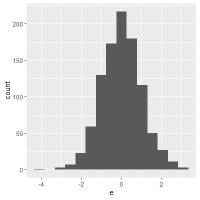{#fig-08_01a}

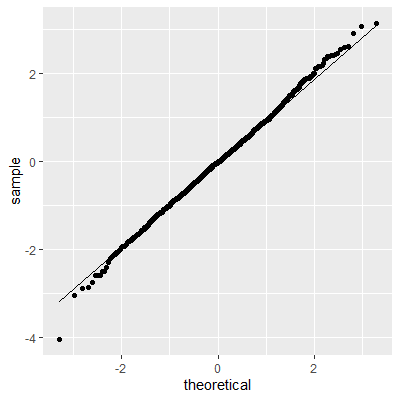{#fig-08_01b}

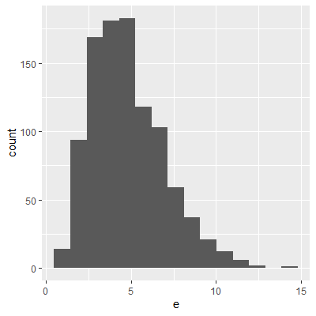{#fig-08_01c}

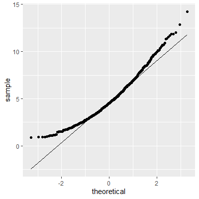{#fig-08_01d}

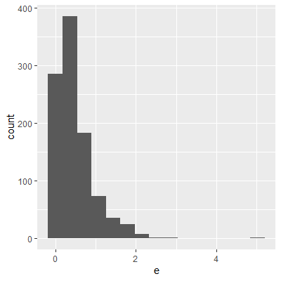{#fig-08_01e}

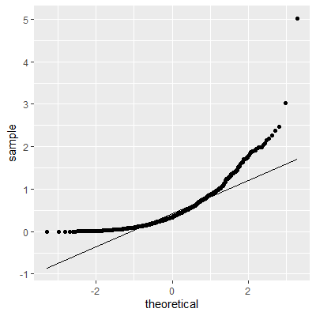{#fig-08_01f}

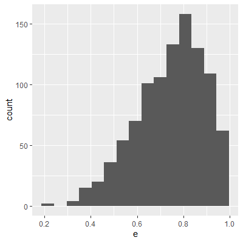{#fig-08_01g}

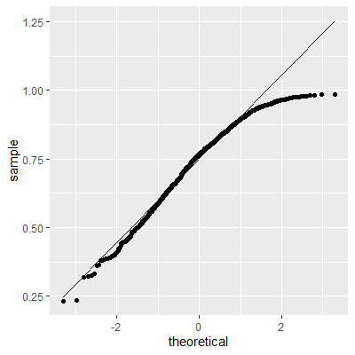{#fig-08_01h}

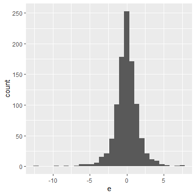{#fig-08_01i}

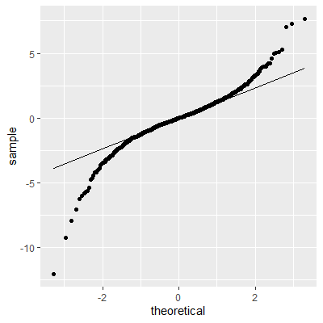{#fig-08_01j}


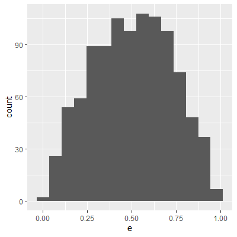{#fig-08_01k}


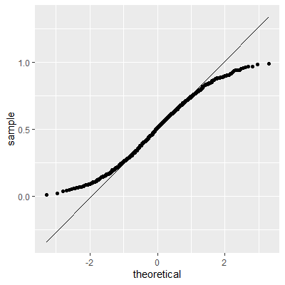{#fig-08_01l}

Examples of QQ-Plots
:::


### The Shapiro-Wilk Test

There are a number of hypothesis test for normality. The most popular test is the *Shapiro-Wilk*[^5^] test. This test has been found to have the most power among many of the other tests for normality[^6^].

[^5^]: Shapiro, S. S., & Wilk, M. B. (1965). An analysis of variance test for normality (complete samples). *Biometrika*, 52(3-4), 591-611.

[^6^]: Razali, N. M., & Wah, Y. B. (2011). Power comparisons of shapiro-wilk, kolmogorov-smirnov, lilliefors and anderson-darling tests. *Journal of statistical modeling and analytics*, 2(1), 21-33.

In the Shapiro-Wilk test, the null hypothesis is that the data are normally distributed and the alternative is that the data are not normally distributed.


This test can be conducted using the `shapiro.test` function in base R.


