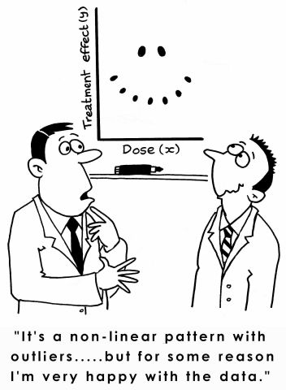

# Model Inferences and Second-Order Models

> 

## Inferences for the Parameters

As they were in the simple regression case, the least squares estimators
${\bf b}$ are unbiased
$$
\begin{align}
{\bf E}\left[{\bf b}\right] & =\boldsymbol{\beta}
\end{align}
$${#eq-w4_29}

The $p\times p$ covariance matrix is 
$$
\begin{align}
{\bf Cov}\left[{\bf b}\right] & =\sigma^{2}\left({\bf X}^{\prime}{\bf X}\right)^{-1}
\end{align}
$${#eq-w4_30}

We can estimate the covariance matrix by using MSE as an estimate
for $\sigma^{2}$. We will denote this estimated covariance matrix
as
$$
\begin{align}
{\bf s}^{2}\left[{\bf b}\right] & =MSE\left({\bf X}^{\prime}{\bf X}\right)^{-1}
\end{align}
$${#eq-w4_31}

From ${\bf s}^{2}\left[{\bf b}\right]$, we can obtain $s^{2}\left[b_{0}\right]$,
$s^{2}\left[b_{1}\right]$, or the variance for any other coefficient
to use in the confidence intervals and hypothesis tests. 


### Confidence Intervals for the Coefficients

A $\left(1-\alpha\right)100\%$ confidence interval for the parameter
$\beta_{k}$ is 
$$
\begin{align}
b_{k} & \pm t_{\alpha/2,n-p}s\left[b_{k}\right]
\end{align}
$${#eq-w4_32}


### Tests for the Coefficients

We can test the hypothesis
$$
\begin{align*}
H_{0}: & \beta_{k}=0\\
H_{a}: & \beta_{k}\ne0
\end{align*}
$$
with the test statistic
$$
\begin{align}
t^{*} & =\frac{b_{k}}{s\left[b_{k}\right]}
\end{align}
$${#eq-w4_33}
where $t^{*}\sim t\left(n-p\right)$. 


::: {#exm-13_1 .example title="Bodyfat data from Kutner"}

The `bodyfat` data are from Kutner[^1^].

[^1^]: Kutner, M. H., Nachtsheim, C. J., Neter, J., & Li, W. (2004). Applied Linear Statistical Models McGraw-Hill/lrwin series operations and decision sciences.


In this dataset the bodyfat, tricep skinfold thickness, thigh circumference, and midarm circumference are found for 20 healthy females 25-34 years old. We want to model bodyfat based on the other three variables.

```{r message=FALSE, warning=FALSE}
library(tidyverse)
library(tidymodels)

dat <- read_table("BodyFat.txt")

# Prepare data
dat_recipe <- recipe(
  bfat ~ tri + thigh + midarm,
  data = dat
)

# Set up model
lm_model <- linear_reg() |>
  set_engine("lm")

# Set up the workflow
lm_workflow <- workflow() |>
  add_recipe(dat_recipe) |> 
  add_model(lm_model)

# Fit the model
lm_fit <- lm_workflow |>
  fit(data = dat)

# Get the coefficients and confidence intervals
bodyfat_coefficients <- lm_fit |>
  tidy(conf.int = TRUE, conf.level = 0.95)

knitr::kable(bodyfat_coefficients, digits = 4)

```


Note that each coefficient is insignificant when tested individually. Let's use the global F-test to see if the model is useful. 

```{r warning=FALSE, message=FALSE}
bodyfat_global_test <- lm_fit |>
  glance()

bodyfat_global_test |>
  select(r.squared, adj.r.squared, statistic, p.value, df, df.residual) |>
  knitr::kable(digits = 4)

```

The global F-test is significant. The reason for the contradiction between the t-tests and the F-test will be discussed when we examine the correlation between predictor variables. 
:::

::: {.callout-warning collapse="false" title="A significant F-test can coexist with nonsignificant individual t-tests"}

The global $F$-test and the individual coefficient $t$-tests ask different questions.

- The global $F$-test asks whether the predictors are collectively useful.
- An individual $t$-test asks whether one coefficient is different from 0 after accounting for the other predictors.

When predictors are strongly correlated with one another, the model may explain substantial variation overall, while individual slopes are hard to estimate precisely. This is a preview of multicollinearity.

:::


####  Recommendation for Checking the Utility of a Multiple Regression Model

1. First, conduct a test of *overall* model adequacy using the F-test.

    If the model is deemed adequate (i.e., if you reject $H_0$), then proceed to step 2. Otherwise, you should hypothesize and fit another model. The new model may include more independent variables or higher-order terms.

2. Conduct *$t$-tests* on those $\beta$ parameters in which you are particularly interested (i.e., the "most important” $\beta$’s). It is safe practice to limit the number of $\beta$’s that are tested. Conducting a series of $t$-tests leads to a high overall Type I error rate.

   

Extreme care should be exercised when conducting $t$-tests on the individual $\beta$ parameters in a first-order linear
model for the purpose of determining which independent
variables are useful for predicting $y$ and which are not. 

If you fail to reject $H_0: \beta_j = 0$, several conclusions are possible:

1. There is *no* relationship between $y$ and $x_j$.

2. A straight-line relationship between $y$ and $x_j$ exists (holding the other $x$’s in the model fixed), but a *Type II error* occurred.

3. A relationship between $y$ and $x_j$ (holding the other $x$’s in the model fixed) exists, but is more complex than a straight-line relationship (e.g., a curvilinear relationship may be appropriate). The most you can say about a $\beta$ parameter test is that there is either sufficient (if you reject $H_0: \beta_j=0$) or insufficient (if you do not reject $H_0: \beta_j=0$) evidence of a *linear* (straight-line) relationship between $y$ and $x_j$.


## Coefficient of Multiple Determination


As was the case with the simple regression model, the coefficient of determination for the multiple regression model (or the *coefficient of multiple determination*) is 
$$
\begin{align}
R^{2} & ={\frac{SSR}{SSTO}}\\
& {=1-\frac{SSE}{SSTO}}
\end{align}
$${#eq-w4_43}

The interpretation is still the same: it gives the proportion of the variation in $y$ explained by the model using the predictor variables.

### Adjusted Coefficient of Determination


It is of importance to note that $R^{2}$ cannot decrease when adding
another $x$ to the model. It can either *increase* (if the new $x$
explains more of the variability of $y$) or stay the *same* (if the
new $x$ does not explain more of the variability of $y$). This can
be seen in @eq-w4_43 by noting that SSE cannot become larger by including
more $X$ variables and SSTO stays the same regardless of which $X$
variables are used. 


Because of this, $R^{2}$ cannot be used for comparing the fit of
models with different subsets of the $x$ variables. 


A modified version of the $R^{2}$ could be used that adjusts for
the number of $X$ variables. It is called the *adjusted* coefficient
of determination denoted as $R_{a}^{2}$. 


In $R_{a}^{2}$, SSE and
SSTO are divided by their respective degrees of freedom:
$$
\begin{align}
R_{a}^{2} & =1-\frac{\frac{SSE}{n-p}}{\frac{SSTO}{n-1}}\\
& =1-\left(\frac{n-1}{n-p}\right)\frac{SSE}{SSTO}
\end{align}
$${#eq-w4_44}

The value of $R_{a}^{2}$ can decrease when another $x$ is included
in the model because any decrease in SSE may be more than offset by
the loss of a *degree of freedom* of SSE ($n-p$).

::: {.example title="Worked example: Comparing `R^2` and adjusted `R^2`"}

Ordinary $R^2$ cannot decrease when predictors are added to a model. Adjusted $R^2$ can decrease if the added predictor does not improve the model enough to justify the lost degree of freedom.

Using the `bodyfat` data, compare three nested models:

```{r warning=FALSE, message=FALSE}
bodyfat_rsq_compare <- list(
  "tri only" = lm(bfat ~ tri, data = dat),
  "tri + thigh" = lm(bfat ~ tri + thigh, data = dat),
  "tri + thigh + midarm" = lm(bfat ~ tri + thigh + midarm, data = dat)
) |>
  purrr::imap_dfr(
    function(fit, model_name) {
      broom::glance(fit) |>
        mutate(model = model_name)
    }
  ) |>
  select(model, r.squared, adj.r.squared, sigma, df.residual)

knitr::kable(bodyfat_rsq_compare, digits = 4)
```

The important lesson is not simply to choose the model with the largest $R^2$. Since $R^2$ rewards every added predictor, adjusted $R^2$ is often more useful when comparing models with different numbers of predictors.

:::


## Estimation and Prediction of the Response


### Estimating the Mean Response


We estimate the mean response as we did in the simple linear case except now we will estimate at a vector of values:
$$
\begin{align*}
{\bf X}_{h} & =\left[\begin{array}{c}
1\\
x_{h1}\\
x_{h2}\\
\vdots\\
x_{h,p-1}
\end{array}\right]
\end{align*}
$$

So the estimated mean response will be the regression function evaluated
at ${\bf X}_{h}$:
$$
\begin{align}
\hat{Y}_{h} & ={\bf X}_{h}^{\prime}{\bf b}
\end{align}
$${#eq-w4_45}
The variance of the estimated mean response is
$$
\begin{align}
Var\left[\hat{Y}_{h}\right] & =\sigma^{2}{\bf X}_{h}^{\prime}\left({\bf X}^{\prime}{\bf X}\right)^{-1}{\bf X}_{h}
\end{align}
$${#eq-w4_46}

We can estimate the variance as
$$
\begin{align}
s^{2}\left[\hat{Y}_{h}\right] & =MSE{\bf X}_{h}^{\prime}\left({\bf X}^{\prime}{\bf X}\right)^{-1}{\bf X}_{h}
\end{align}
$${#eq-w4_47}

We can then obtain a $\left(1-\alpha\right)100\%$ confidence interval
for the mean response at ${\bf X}_{h}$ as
$$
\begin{align}
\hat{Y}_{h} & \pm t_{\alpha/2}s\left[\hat{Y}_{h}\right]
\end{align}
$${#eq-w4_48}
where $t_{\alpha/2}$ has $n-p$ degrees of freedom.

### Predicting the Response


We can predict a new response $Y_{h\left(new\right)}$ at some ${\bf X}_{h}$
with  a $\left(1-\alpha\right)100\%$ prediction interval
$$
\begin{align}
\hat{Y}_{h} & \pm t_{\alpha/2}s\left[Y_{h\left(pred\right)}\right]
\end{align}
$${#eq-w4_49}
where 
$$
\begin{align}
s^{2}\left[Y_{h\left(pred\right)}\right] & =MSE\left(1+{\bf X}_{h}^{\prime}\left({\bf X}^{\prime}{\bf X}\right)^{-1}{\bf X}_{h}\right)
\end{align}
$${#eq-w4_50}


::: {#exm-13_2 .example title="Mean response interval versus prediction interval"}

This example revisits @exm-13_1.

For the bodyfat data, suppose we want to predict and estimate at `tri=25`, `thigh=51.2`, and `midarm=24.9`. We will use the `predict` function.

```{r message=FALSE, warning=FALSE}
new_dat <- tibble(tri = 25, thigh = 51.2, midarm = 24.9)

# Confidence interval for mean response
mean_interval <- lm_fit |>
  predict(new_dat, type = "conf_int", level = 0.95) |>
  rename(
    mean_lower = .pred_lower,
    mean_upper = .pred_upper
  )

# Prediction interval for one new response
prediction_interval <- lm_fit |>
  predict(new_dat, type = "pred_int", level = 0.95) |>
  rename(
    prediction_lower = .pred_lower,
    prediction_upper = .pred_upper
  )

interval_comparison <- bind_cols(
  new_dat,
  mean_interval,
  prediction_interval
)

knitr::kable(interval_comparison, digits = 4)

```

The confidence interval estimates the mean body fat for all healthy females with these predictor values. The prediction interval estimates a plausible range for one new person's body fat with these predictor values.

The prediction interval is wider because it includes both uncertainty in the estimated mean and individual-to-individual variability around that mean.

:::


## Second-Order Models 

::: {.callout-note collapse="false" title="R formula syntax for second-order terms"}

R has compact formula syntax for interactions and polynomial terms.

| Modeling idea | Mathematical term | Base R formula syntax | Recipe syntax |
|---|---|---|---|
| Main effects only | $x_1+x_2$ | `y ~ x1 + x2` | `recipe(y ~ x1 + x2, data = dat)` |
| Interaction only | $x_1x_2$ | `y ~ x1:x2` | `recipe(y ~ x1:x2, data = dat)` |
| Main effects plus interaction | $x_1+x_2+x_1x_2$ | `y ~ x1 * x2` | `recipe(y ~ x1 * x2, data = dat)` |
| Raw quadratic term | $x+x^2$ | `y ~ x + I(x^2)` | `recipe(y ~ x, data = dat) |> step_mutate(x2 = x^2)` |
| Orthogonal polynomial terms | polynomial basis terms | `y ~ poly(x, degree = 2)` | `recipe(y ~ x, data = dat) |> step_poly(x, degree = 2)` |

The expression `x1 * x2` is shorthand for `x1 + x2 + x1:x2`. The colon `:` creates only the interaction term.

Use `I(x^2)` when you want R to interpret `x^2` as ordinary arithmetic inside a formula. Without `I()`, formula operators have special meanings.

:::

::: {.example title="Worked example: Formula syntax for interactions and quadratic terms"}

The following formulas represent different models:

```{r warning=FALSE, message=FALSE}
formula_examples <- tibble(
  model = c(
    "First-order model",
    "Interaction model",
    "Raw quadratic model",
    "Orthogonal polynomial model"
  ),
  formula = c(
    "y ~ x1 + x2",
    "y ~ x1 * x2",
    "y ~ x + I(x^2)",
    "y ~ poly(x, degree = 2)"
  ),
  terms_in_model = c(
    "intercept, x1, x2",
    "intercept, x1, x2, x1:x2",
    "intercept, x, x^2",
    "intercept, two polynomial basis terms"
  )
)

knitr::kable(formula_examples)
```

The raw quadratic form `I(x^2)` is usually easier to connect to the algebraic model $\beta_0+\beta_1x+\beta_2x^2$. The `step_poly()` approach is often more numerically stable, but the resulting polynomial columns are transformed basis terms rather than a literal `x^2` column.

:::


### Simulating data in R

In R, there are a number of functions involving probability distributions. Each available distribution will have some functions that can be utilized. For the normal distribution, we can access the functions

- `dnorm` - gives the *density* (pdf) of the distribution
- `pnorm` - gives the *cumulative* distribution function (cdf)
- `qnorm` - gives the *quantile* of the distribution
- `rnorm` - gives a *random sample* from the distribution


Different distributions will have the same four functions with the starting letter above. For example, if we want to use the binomial distribution, we can use the functions `dbinom`, `pbinom`, `qbinom`, and `rbinom`. 

If we use the following code:

```{r warning=FALSE, message=FALSE}
set.seed(34)

x = rnorm(100)

ggplot(data = data.frame(x))+
  aes(x=x)+
  geom_histogram(bins = 10)
```


Note that the histogram is shown for *one* random sample. If you were to run the code again, it would give you a *different* sample and a different histogram. 

If we would like to simulate from a normal distribution with mean 10 and standard deviation of 5, we would use the code `rnorm(100, mean = 10, sd = 5)`


### Simulating a regression model


Suppose we had the regression model
$$
\begin{align*}
    y =& 1+2x_1 - x_2 + \varepsilon\\
    &\varepsilon \sim N(0, 0.1)
\end{align*}
$$

We can use the `rnorm` function to obtain a sample of the error terms.

::: {.example title="Worked example: Simulating a first-order model with parallel lines"}

```{r warning=FALSE, message=FALSE}
n = 100
eps = rnorm(100, mean = 0, sd = 0.1)

```


We now will obtain some values of the $x$s. Let's make the values of $x_1$ be values from 0 to 3. The values of $x_2$ will be only the values 0, 1, 2. Thus, both predictors are *quantitative* but $x_2$ is discrete. 

We can simulate from the model by:
```{r warning=FALSE, message=FALSE}
n = 300
eps = rnorm(n, mean = 0, sd = 0.1)

x1values = seq(0, 3, length = n/3)
x2values = c(0, 1, 2)

values = expand.grid(x1values, x2values)

x1 = values[,1]
x2 = values[,2]

y = 1 + 2*x1- x2 + eps

df = data.frame(y = y, x1 = x1, x2 = factor(x2))
ggplot(df)+
  aes(x = x1, y = y, color = x2)+
  geom_point()
```

In this first-order model, the effect of $x_1$ does not depend on the value of $x_2$. If we draw separate lines for each fixed value of $x_2$, the lines are parallel.

:::


### An Interaction Model with Quantitative Predictors

 When $E(y)$ is
graphed against any one variable (say, $x_1$) for *fixed* values of the
other variables, the result is a set of *parallel* straight lines (like the plot above). 

When this situation occurs (as it always does for a
first-order model), we say that the relationship between $E(y)$ and
any one independent variable does not *depend* on the values of the
other independent variables in the model.


However, if the relationship between $E(y)$ and $x_1$ does, in fact,
depend on the values of the remaining $x$’s held fixed, then the first-
order model is not appropriate for predicting $y$. In this case, we need
another model that will take into account this dependence. Such a
model includes the cross products of two or more $x$’s.


For example, suppose that the mean value $E(y)$ of a response $y$ is
related to two quantitative independent variables, $x_1$ and $x_2$, by the
model
$$
\begin{align*}
    E(y) = 1+2x_1-x_2+x_1x_2
\end{align*}
$$

::: {.example title="Worked example: Simulating an interaction model with nonparallel lines"}

Let's simulate from this model and construct a scatterplot of $y$ versus $x_1$ again:
```{r warning=FALSE, message=FALSE}
n = 300
eps = rnorm(n, mean = 0, sd = 0.1)

x1values = seq(0, 3, length = n/3)
x2values = c(0, 1, 2)

values = expand.grid(x1values, x2values)

x1 = values[,1]
x2 = values[,2]

y = 1 + 2*x1- x2 + x1*x2+ eps

df = data.frame(y = y, x1 = x1, x2 = factor(x2))
ggplot(df)+
  aes(x = x1, y = y, color = x2)+
  geom_point()
```


Note that the graph shows three *nonparallel* lines. You can
verify that the slopes of the lines differ by substituting each of the
values $x_2 = 0, 1$, and 2 into the equation. 


For $x_2 = 0$:
$$
\begin{align*}
    E(y) &= 1+2x_1 - (0) + x_1(0)\\
    & = 1+2x_1
\end{align*}
$$

For $x_2 =1$:
$$
\begin{align*}
    E(y) &= 1+2x_1 - (1) + x_1(1)\\
    & = 3x_1
\end{align*}
$$

For $x_2 = 2$:
$$
\begin{align*}
    E(y) &= 1+2x_1 - (2) + x_1(2)\\
    & = -1 + 4x_1
\end{align*}
$$


Note that the slope of each line is represented by 
$$
\begin{align*}
    \beta_1 + \beta_3 x_2 =  2+x_2
\end{align*}
$$
Thus, the effect on $E(y)$ of a change in $x_1$ (i.e., the slope) now
depends on the value of $x_2$. When this situation occurs, we say that
$x_1$ and $x_2$ *interact*. 

:::

The cross-product term, $x_1x_2$, is called an
*interaction term*, and the model
called an interaction *model* with two quantitative variables.


   Note an important point about
conducting $t$-tests on the $\beta$ parameters in the interaction
model. 

The "most important” $\beta$ parameter in this model is
the interaction term,  $\beta_3$. 

Consequently, we will want to test $H_0: \beta_3 = 0$ after
we have determined that the overall model is useful for
predicting $y$. Once interaction is detected tests on the first-order terms $x_1$ and $x_2$
should not be conducted since they are *meaningless*
tests; the presence of interaction implies that both $x$’s are
important.

::: {.callout-warning collapse="false" title="Do not interpret main effects in isolation when an interaction is present"}

When a model contains an interaction term such as $x_1x_2$, the effect of $x_1$ depends on the value of $x_2$, and the effect of $x_2$ depends on the value of $x_1$.

That means a test of a first-order term by itself can be misleading. A common modeling practice is the *hierarchy principle*: if an interaction is included, keep the corresponding lower-order terms in the model unless there is a strong reason not to.

:::


### A Quadratic (Second-Order) Model with a Quantitative Predictor

All of the models discussed thus far proposed
straight-line relationships between $E(y)$ and each of the
independent variables in the model. 

We now consider a
model that allows for *curvature* in the relationship. 

This model is a
*second-order* model because it will include an $x^2$ term[^2^].

[^2^]: Note: the interaction model is also second-order since it has two $x$s multiplied.


Here, we consider a model that includes only one independent
variable $x$. The form of this model, called the *quadratic* model, is
$$
\begin{align*}
    y = \beta_0 + \beta_1 x + \beta_2 x^2 + \varepsilon
\end{align*}
$$


## A Test for Comparing Nested Models

In regression analysis, we often want to determine (with a high
degree of confidence) which one among a set of *candidate models*
best fits the data. 

We present such a method for
*nested* models.

Two models are nested if one model contains
all the terms of the second model and at least
one additional term. The more complex of the
two models is called the *complete* (or *full*)
model. The simpler of the two models is called
the *reduced* (or *restricted*) model.


  
To illustrate, suppose you have collected data on a response, $y$,
and two quantitative independent variables, $x_1$ and $x_2$, and you are
considering the use of either a straight-line interaction model or a
curvilinear model to relate $E(y)$ to $x_1$ and $x_2$. 

Will the curvilinear
model provide better predictions of $y$ than the straight-line model?


To answer this question, examine the two models, and note that the
curvilinear model contains all the terms in the straight-line
interaction model plus two additional terms—those involving $\beta_4$ and
$\beta_5$:
$$
\begin{align*}
    E(y) &= \beta_0 + \beta_1 x_1 + \beta_2 x_2 + \beta_3 x_1 x_2 &\quad \text{Straight-line with interaction}\\
    E(y) &= \beta_0 + \beta_1 x_1 + \beta_2 x_2 + \beta_3 x_1 x_2+ \beta_4 x^2_1 +\beta_5 x_2^2&\quad \text{Curvilinear model}
\end{align*}
$$


Consequently, these are nested models. Since the straight-line
model is the simpler of the two, we say that the straight-line model
is nested within the more complex curvilinear model.

Also, the
straight-line model is called the reduced model while the curvilinear
model is called the complete (or full) model.


Asking whether the curvilinear (or complete) model contributes
more information for the prediction of $y$ than the straight-line (or
reduced) model is equivalent to asking whether at least one of the
parameters, $\beta_4$ or $\beta_5$, differs from 0. Therefore, to test
whether the quadratic terms should be included in the model, we
test the null hypothesis
$$
\begin{align*}
    H_0: \beta_4 = \beta_5 = 0
\end{align*}
$$
(i.e., the quadratic terms do not contribute information for the
prediction of $y$) against the alternative hypothesis
$$
\begin{align*}
    H_a: \text{At least one of the parameters, }\beta_4 \text{ or } \beta_5, \text{ differs from 0}
\end{align*}
$$
(i.e., at least one of the quadratic terms contributes information for
the prediction of $y$).

The procedure for conducting this test is intuitive. First, we use the
method of least squares to fit the reduced model and calculate the
corresponding sum of squares for error,
$$
SSE_R
$$
Next,
we fit the complete model and calculate its sum of squares for error,
$$
SSE_C
$$

Then, we compare $SSE_R$ to $SSE_C$ by calculating the
difference,
$$
SSE_R - SSE_C
$$
 If the quadratic terms contribute to the
model, then $SSE_C$ should be much smaller than $SSE_R$, and the
difference will be large. The larger the difference, the
greater the weight of evidence that the complete model provides
better predictions of $y$ than does the reduced model.


The sum of squares for error will always decrease when new terms
are added to the model. The question is whether this decrease is
large enough to conclude that it is due to more than just an increase
in the number of model terms and to chance. 

::: {.callout-note collapse="false" title="How to read the nested F-test"}

The nested F-test compares a reduced model to a complete model.

- The reduced model is simpler.
- The complete model contains every term in the reduced model plus one or more additional terms.
- The test asks whether the extra terms reduce SSE enough to justify the added complexity.

This test only applies when the models are truly nested.

:::

To test the null
hypothesis that the curvature coefficients simultaneously
equal 0, we use an F statistic. For our example, this F statistic is:
$$
\begin{align*}
    F = \frac{\frac{(SSE_R - SSE_C)}{\text{Number of parameters being tested}}}{\frac{SSE_C}{n-p}}
\end{align*}
$$

When the candidate models in model building are nested
models, the $F$-test is the appropriate
procedure to apply to compare the models. However, if the
models are not nested, this $F$-test is not applicable. In this
situation, the analyst must base the choice of the best model on
statistics such as $R^2_a$. It is important to remember that
decisions based on these and other numerical descriptive
measures of model adequacy cannot be supported with a
measure of reliability and are often very subjective in nature.


::: {#exm-13_3 .example title="Nested F-test for an added quadratic term"}

This example revisits @exm-13_1.

Suppose, for some reason, we were to hypothesize that the model needs the term `midarm^2`. We can conduct a nested F-test to see if this extra term is significant.

```{r message=FALSE, warning=FALSE}
library(tidyverse)
library(tidymodels)

# Prepare data for the complete model
dat_recipe <- recipe(
  bfat ~ tri + thigh + midarm,
  data = dat
) |>
  step_poly(midarm, degree = 2)

# Set up model
lm_model <- linear_reg() |>
  set_engine("lm")

# Set up the workflow for complete model
lm_workflow <- workflow() |>
  add_recipe(dat_recipe) |> 
  add_model(lm_model)

# Fit the complete model
lm_fit_C <- lm_workflow |>
  fit(data = dat)

# Set up the workflow for reduced model
lm_workflow_R <- lm_workflow |>
  update_recipe(
    dat_recipe |> step_rm(midarm_poly_2)
  )

# Fit the reduced model
lm_fit_R <- lm_workflow_R |>
  fit(data = dat)

# Extract the models and conduct nested F-test
model_C <- lm_fit_C |> extract_fit_engine()
model_R <- lm_fit_R |> extract_fit_engine()

nested_test <- anova(model_R, model_C)

knitr::kable(nested_test, digits = 4)

```

Since the p-value is greater than 0.05, there is not enough evidence to conclude that the quadratic term coefficient is different from 0.

:::

## Recap

This chapter extended inference from the overall ANOVA F-test to coefficient-level inference, response intervals, second-order models, and nested model comparisons.

| Idea | Meaning |
|---|---|
| **Unbiased coefficient estimates** | The least-squares coefficient vector satisfies $E({\bf b})={\boldsymbol\beta}$. |
| **Estimated covariance matrix of coefficients** | $MSE({\bf X}'{\bf X})^{-1}$ estimates the covariance matrix of ${\bf b}$. |
| **Coefficient confidence interval** | $b_k \pm t_{\alpha/2,n-p}s[b_k]$. |
| **Individual coefficient t-test** | Tests whether one coefficient is 0 after accounting for the other predictors. |
| **Global F-test** | Tests whether the predictors are collectively useful. |
| **$R^2$** | The proportion of variation in the response explained by the model. |
| **Adjusted $R^2$** | A version of $R^2$ that penalizes the model for using more predictors. |
| **Confidence interval for mean response** | Estimates the mean response at a specified set of predictor values. |
| **Prediction interval** | Gives a plausible range for one new response at a specified set of predictor values. |
| **Prediction intervals are wider** | They include uncertainty in the estimated mean and individual response variability. |
| **Interaction term** | A product term such as $x_1x_2$ that allows the effect of one predictor to depend on another predictor. |
| **Quadratic term** | A term such as $x^2$ that allows curvature. |
| **R formula syntax** | `x1 * x2` expands to `x1 + x2 + x1:x2`; `I(x^2)` creates a raw quadratic term; `step_poly()` creates polynomial basis terms in a recipe. |
| **Second-order model** | A model that includes interaction terms, squared terms, or both, while remaining linear in the parameters. |
| **Nested models** | A reduced model is nested inside a complete model when the complete model contains all reduced-model terms plus additional terms. |
| **Nested F-test** | Tests whether the additional terms in a complete model reduce SSE enough to justify the added complexity. |

## Check your understanding

::: {.callout-note collapse="false" title="Problems"}

1. What does it mean for the least-squares coefficient estimates to be unbiased?

2. What information is contained in the estimated covariance matrix $MSE({\bf X}'{\bf X})^{-1}$?

3. What does an individual coefficient $t$-test ask in a multiple regression model?

4. Why can the global F-test be significant even when individual coefficient t-tests are not significant?

5. Why should individual coefficient tests be used carefully when many predictors are being considered?

6. Why can ordinary $R^2$ be misleading when comparing models with different numbers of predictors?

7. What does adjusted $R^2$ try to correct?

8. What is the difference between estimating a mean response and predicting a new response?

9. Why is a prediction interval wider than a confidence interval for the mean response?

10. What does an interaction term allow the model to do?

11. In the model $E(y)=\beta_0+\beta_1x_1+\beta_2x_2+\beta_3x_1x_2$, what is the slope with respect to $x_1$ for a fixed value of $x_2$?

12. Why are the lines parallel in a first-order model with no interaction?

13. What does a quadratic term allow the model to represent?

14. What is the difference between `x1:x2` and `x1 * x2` in an R model formula?

15. Why do we use `I(x^2)` when writing a raw quadratic term in a base R formula?

16. What is one difference between `I(x^2)` and `step_poly(x, degree = 2)`?

17. What does it mean for two models to be nested?

18. What question is answered by a nested F-test?

19. Why is a nested F-test not appropriate for comparing models that are not nested?

:::

::: {.callout-tip collapse="true" title="Solutions"}

1. **Correct on average.** Unbiased means that across repeated samples, the average value of the estimator equals the true parameter value.

2. **Variances and covariances of estimates.** The diagonal entries give estimated variances of coefficient estimates, and their square roots give standard errors. The off-diagonal entries describe estimated covariances between coefficient estimates.

3. **One coefficient, conditional on the rest.** It asks whether one coefficient differs from 0 after accounting for the other predictors in the model.

4. **The questions are different.** The global F-test asks whether the predictors are collectively useful. Individual t-tests ask whether each predictor has a clear unique contribution after accounting for the others. Correlated predictors can make individual effects hard to estimate.

5. **Many tests inflate error risk.** Testing many coefficients creates many chances for false positives, especially if tests are used mechanically for model selection.

6. **It cannot decrease.** Ordinary $R^2$ can only increase or stay the same when predictors are added, even if the added predictors are not genuinely useful.

7. **It penalizes complexity.** Adjusted $R^2$ accounts for the number of predictors by using degrees of freedom. It can decrease when an added predictor does not improve the model enough.

8. **Mean versus individual.** A mean-response interval estimates the average response for all units with specified predictor values. A prediction interval estimates a plausible range for one new unit with those predictor values.

9. **More uncertainty is included.** A prediction interval includes uncertainty in the estimated mean plus the natural variability of individual observations around that mean.

10. **Changing slopes.** An interaction term allows the effect of one predictor to depend on the value of another predictor.

11. **$\beta_1+\beta_3x_2$.** The slope with respect to $x_1$ depends on the fixed value of $x_2$.

12. **The slope is constant.** Without an interaction, the effect of $x_1$ does not depend on $x_2$, so separate lines for fixed values of $x_2$ have the same slope.

13. **Curvature.** A quadratic term allows the relationship between the predictor and the mean response to bend instead of being strictly straight.

14. **Interaction only versus main effects plus interaction.** `x1:x2` includes only the interaction term. `x1 * x2` expands to `x1 + x2 + x1:x2`.

15. **To force arithmetic.** In R formulas, some symbols have special formula meanings. `I(x^2)` tells R to treat `x^2` as ordinary arithmetic and include a raw squared predictor.

16. **Raw term versus transformed basis.** `I(x^2)` creates a literal squared predictor. `step_poly(x, degree = 2)` creates polynomial basis columns, often for better numerical behavior, but the columns are not simply named `x` and `x^2`.

17. **One model contains the other.** The reduced model is nested in the complete model if every term in the reduced model also appears in the complete model.

18. **Whether extra terms help.** A nested F-test asks whether the additional terms in the complete model reduce SSE enough to justify the added complexity.

19. **There is no valid reduced-versus-complete decomposition.** If models are not nested, one model is not simply the other plus additional terms, so the nested F-test formula does not apply.

:::
