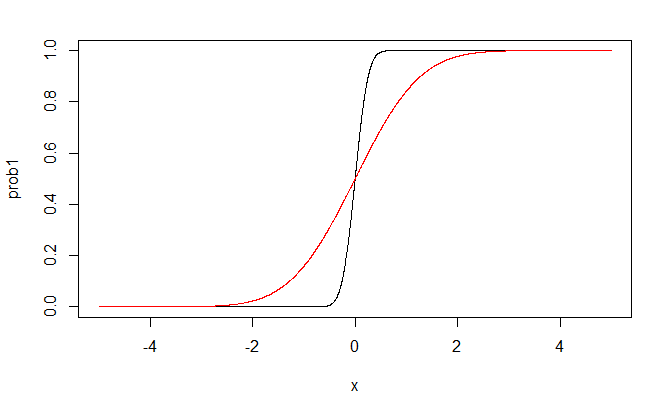
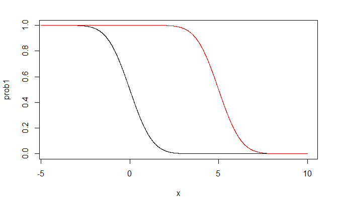
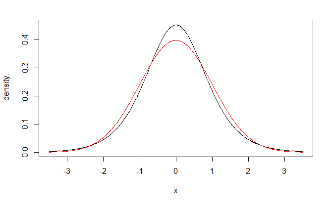
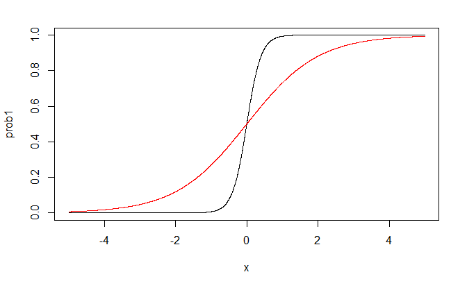
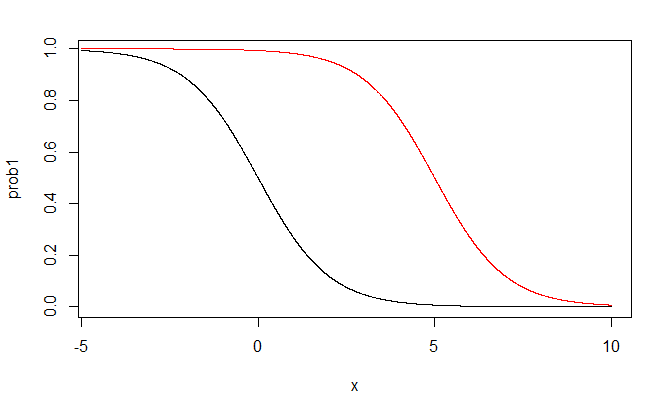

# Introduction to Logistic Regression

> "If all you have is a hammer, everything looks like a nail." - Bernard Baruch

## Binary Response Variable

In a variety of regression applications, the response variable of interest has only two possible *qualitative* outcomes, and therefore can be represented by a binary indicator variable taking on values 0 and 1.

A binary response variable
is said to involve binary responses or dichotomous responses.

We consider first the meaning of the response function when the outcome variable is binary,
and then we take up some special problems that arise with this type of response variable.

### Response Function Meaning

Consider the simple linear regression model
$$
\begin{align*}
y_{i} & =\beta_{0}+\beta_{1}x_{i}+\varepsilon_{i}\qquad y_{i}=0,1
\end{align*}
$$
where the outcome $y_{i}$ is binary taking on the value of either
0 or 1. 

The expected response $E\left[ y_{i}\right] $ has a special meaning
in this case.

Since $E\left[ \varepsilon_{i}\right] =0$, we have
$$
\begin{align*}
E\left[ y_{i}\right]  & =\beta_{0}+\beta_{1}x_{i}
\end{align*}
$$

Consider $y_{i}$ to be a Bernoulli random variable for which we can
state the probability distribution as follows
$$
\begin{align*}
y_{i} & \quad\textbf{ Probability}\\
1 & \quad P\left(y_{i}=1\right)={\pi_{i}}\\
0 & \quad P\left(y_{i}=0\right)={1-\pi_{i}}
\end{align*}
$$

Thus, $\pi_{i}$ is the probability that $y_{i}=1$ and $1-\pi_{i}$
is the probability that $y_{i}=0$

By the definition of a discrete random variable, we have
$$
{\begin{align*}
E\left[ y_{i}\right]  & =1\left(\pi_{i}\right)+0\left(1-\pi_{i}\right)\\
& =\pi_{i}\\
& =P\left(y_{i}=1\right)
\end{align*}}
$$

Thus, 
$$
{\begin{align*}
E\left[ y_{i}\right]  & =\beta_{0}+\beta_{1}x_{i}\\
& =\pi_{i}
\end{align*}}
$$

The mean response $E\{y_i\}$ as given by the response function is therefore simply
the probability that $y_i = 1$ when the level of the predictor variable is $x_i$.

This interpretation
of the mean response applies whether the response function is a simple linear one, as here,
or a complex multiple regression one. 

The mean response, when the outcome variable is
a 0, 1 indicator variable, always represents the probability that $Y = 1$ for the given levels
of the predictor variables.

### Problems when response is binary

Special problems arise, unfortunately, when the response variable is an indicator variable.
We consider three of these now, using a simple linear regression model as an illustration.

1. *Nonnormal error terms*: For a binary 0, 1 response variable, each error term  can take on only two values:
    $$
    \begin{align*}
    \text{When }y_{i}=1: & \quad\varepsilon_{i}=1-\beta_{0}-\beta_{1}x_{i}\\
    \text{When }y_{i}=0: & \quad\varepsilon_{i}=0-\beta_{0}-\beta_{1}x_{i}
    \end{align*}
    $$

    Clearly, normal error regression model, which assumes that the $\varepsilon_i$ are normally distributed, is not appropriate.

2. *Nonconstant Error Variance*:  Another problem with the error terms  is that they do
not have equal variances when the response variable is an indicator variable.

    To see this, note that
    $$
    \begin{align*}
    Var[\varepsilon_i] = (\beta_{0}+\beta_{1}x_{i})(1-\beta_{0}-\beta_{1}x_{i})
    \end{align*}
    $$
    
    Note that $Var\{\varepsilon_i\}$ depends on $x_i$. Hence, the error variances will differ at
    different levels of X, and ordinary least squares will no longer be optimal. 

3. *Constraints one Response Function*: Since the response function represents probabilities when the outcome variable is a 0, 1 indicator variable, the mean responses should be constrained as follows:
    $$
    0\le E\{Y\}=\pi \le 1
    $$

    The difficulties created by the need for the restriction  on the response function are the most serious. 

    One could use weighted least squares to handle the problem of unequal error variances. 

    In addition, with large sample sizes the method of least squares provides estimators that are asymptotically normal under quite general conditions, even if the distribution of the error terms is far from normal.

    However, the constraint on the mean responses to fall between 0 and 1 frequently will rule out a linear response function.  

## Sigmoidal Response Functions

In this section, we will examine two response functions for modeling binary responses. 

These
functions are bounded between 0 and 1, have a characteristic *sigmoidal*- or S-shape, and
approach 0 and 1 asymptotically. 

These functions arise naturally when the binary response
variable results from a zero-one recoding (or dichotomization) of an underlying continuous
response variable, and they are often appropriate for discrete binary responses as well.

### Probit Mean Response Function

Consider a health researcher studying the effect of a mother's use of alcohol ($x$ -an index
of degree of alcohol use during pregnancy) on the duration of her pregnancy ($y^C$). 

Here
we use the superscript $c$ to emphasize that the response variable, pregnancy duration, is a
*continuous* response. 

This can be represented by a simple linear regression model:
$$
y^C_i = \beta_0^c+\beta_1^c x_i +\varepsilon_i^c
$$
and we will assume that $\varepsilon^c_i$ is normally distributed with mean zero and variance $\sigma^2_c$.

If the continuous response variable, pregnancy duration, were available, we might proceed
with the usual simple linear regression analysis. However, in this instance, researchers
coded each pregnancy duration as preterm or full term using the following rule:
$$
\begin{align*}
y_{i} & =\begin{cases}
1 & \text{ if }y_{i}^{c}\le38\text{ weeks (preterm)}\\
0 & \text{ if }y_{i}^{c}>38\text{ weeks (full term)}
\end{cases}
\end{align*}
$$

It follows then that
$$
\begin{align*}
P\left(y_{i}=1\right)=\pi_{i} & =P\left(y_{i}^{c}\le38\right)\\
& =P\left(\beta_{0}^{c}+\beta_{1}^{c}x_{i}+\varepsilon_{i}^{c}\le38\right)\\
& =P\left(\varepsilon_{i}^{c}\le38-\beta_{0}^{c}-\beta_{1}^{c}x_{i}\right)\\
& =P\left(\frac{\varepsilon_{i}^{c}}{\sigma_{c}}\le\frac{38-\beta_{0}^{c}}{\sigma_{c}}-\frac{\beta_{1}^{c}}{\sigma_{c}}x_{i}\right)\\
& =P\left(Z\le\beta_{0}^{*}+\beta_{1}^{*}x_{i}\right)
\end{align*}
$$
where 
$$
\begin{align*}
\beta_{0}^{c} & =\frac{38-\beta_{0}^{c}}{\sigma_{c}}\\
\beta_{1}^{c} & =-\frac{\beta_{1}^{c}}{\sigma_{c}}\\
Z & =\frac{\varepsilon_{i}^{c}}{\sigma_{c}}.
\end{align*}
$$

Note that $Z$ follows a standard normal distribution.

If we let $P\left(Z\le z\right)=\Phi\left(z\right)$, we have
$$
\begin{align*}
P\left(y_{i}=1\right) & =\Phi\left(\beta_{0}^{*}+\beta_{1}^{*}x_{i}\right)
\end{align*}
$$

From this we have what is known as the probit mean response function
$$
\begin{align*}
E\left[ y_{i}\right]  & =\pi_{i}=\Phi\left(\beta_{0}^{*}+\beta_{1}^{*}x_{i}\right)
\end{align*}
$$

The inverse function $\Phi^{-1}$ of the standard normal cumulative distribution function is sometimes called the *probit transformation*.

We solve for the linear predictor $\beta_{0}^{*}+\beta_{1}^{*}x_{i}$ by applying the probit transformation to both sides of the expression:
$$
\begin{align*}
\Phi^{-1}\left(\pi_{i}\right) & =\pi_{i}^{\prime}=\beta_{0}^{*}+\beta_{1}^{*}x_{i}
\end{align*}
$$

The resulting expression $\pi_{i}^{\prime}=\beta_{0}^{*}+\beta_{1}^{*}x_{i}$
is called the probit response function, or more generally, the linear
predictor.

#### Example: $\beta_0^*=0$}

black line: $\beta_1^*=5$

red line: $\beta_1^*=1$

#### Example: $\beta_1^*=-1$}

black line: $\beta_0^*=0$

red line: $\beta_0^*=5$

## Logistic Mean Response Function

We have seen that the assumption of normally distributed errors for the underlying continuous
response variable led to the use of the standard normal cumulative distribution
function, $\Phi$  to model $\pi_i$.

An alternative error distribution that is very similar to the normal
distribution is the *logistic* distribution. 

Plots of the standard normal
density function and the logistic density function, each with mean zero and variance one are nearly indistinguishable, although the logistic distribution has slightly heavier tails.

Note the cumulative distribution function of a logistic random variable
$\varepsilon_{L}$ having mean 0 and standard deviation $\sigma=\pi/\sqrt{3}$
is:
$$
\begin{align*}
F_{L}\left(\varepsilon_{L}\right) & =\frac{\exp\left(\varepsilon_{L}\right)}{1+\exp\left(\varepsilon_{L}\right)}
\end{align*}
$$

Suppose now that $\varepsilon_{i}^{c}$ has a logistic distribution
with mean 0 and standard deviation $\sigma_{c}$. Then we have
$$
\begin{align*}
P\left(y_{i}=1\right) & =P\left(\frac{\varepsilon_{i}^{c}}{\sigma_{c}}\le\beta_{0}^{*}+\beta_{1}^{*}x_{1}\right)
\end{align*}
$$
where $\varepsilon_{i}^{c}/\sigma_{c}$ follows a logistic distribution
with mean zero and standard deviation one. 

Multiplying both sides of the inequality inside the probability statement
on the right by $\pi/\sqrt{3}$ gives us
$$
\begin{align*}
P\left(y_{i}=1\right)=\pi_{i} & =P\left(\frac{\pi}{\sqrt{3}}\frac{\varepsilon_{i}^{c}}{\sigma_{c}}\le\frac{\pi}{\sqrt{3}}\beta_{0}^{*}+\frac{\pi}{\sqrt{3}}\beta_{1}^{*}x_{i}\right)\\
& =P\left(\varepsilon_{L}\le\beta_{0}+\beta_{1}x_{i}\right)\\
& =F_{L}\left(\beta_{0}+\beta_{1}x_{i}\right)\\
& =\frac{\exp\left(\beta_{0}+\beta_{1}x_{i}\right)}{1+\exp\left(\beta_{0}+\beta_{1}x_{i}\right)}
\end{align*}
$$
where
$$
\begin{align*}
\beta_{0} & =\frac{\pi}{\sqrt{3}}\beta_{0}^{*}\\
\beta_{1} & =\frac{\pi}{\sqrt{3}}\beta_{1}^{*}
\end{align*}
$$
denote the logistic regression parameters. 

To summarize, the logistic mean response function is
$$
\begin{align*}
E\left[ y_{i}\right]  & =\pi_{i}\\
& =F_{L}\left(\beta_{0}+\beta_{1}x_{i}\right)\\
& =\frac{\exp\left(\beta_{0}+\beta_{1}x_{i}\right)}{1+\exp\left(\beta_{0}+\beta_{1}x_{i}\right)}\\
& =\frac{1}{1+\exp\left(-\beta_{0}-\beta_{1}x_{i}\right)}
\end{align*}
$$

Applying the inverse of the cumulative distribution function $F_{L}$
gives
$$
\begin{align*}
F_{L}^{-1}\left(\pi_{i}\right) & =\beta_{0}+\beta_{1}x_{1}=\pi_{i}^{\prime}
\end{align*}
$$

$F_{L}^{-1}\left(\pi_{i}\right)$ is called the *logit transformation*
and is given by
$$
\begin{align*}
F_{L}^{-1}\left(\pi_{i}\right) & =\log\left(\frac{\pi_{i}}{1-\pi_{i}}\right)
\end{align*}
$$
where the ratio $\pi_{i}/\left(1-\pi_{i}\right)$ is called the *odds} *ratio}.

#### Example: $\beta_0^*=0$

black line: $\beta_1^*=5$

red line: $\beta_1^*=1$

#### Example: $\beta_1^*=-1$

black line: $\beta_0^*=0$

red line: $\beta_0^*=5$

## Interpretation of the Coefficients

The interpretation of the estimated regression coefficient $\hat{\beta}_1$ in the fitted logistic response
function  is not the straightforward interpretation of the slope in a linear regression
model. 

The reason is that the effect of a unit increase in $x$ varies for the logistic regression
model according to the location of the starting point on the $x$ scale. 

An interpretation of $\hat{\beta}_1$
is found in the property of the fitted logistic function that the estimated odds 
$$
\frac{\hat{\pi}}{1-\hat{\pi}}
$$
are
multiplied by 
$$
\exp(\hat{\beta}_1)
$$
for any unit increase in $x$.

To see this, we consider the value of the fitted logit response function at $X = x_j$;
$$
\hat{\pi}^\prime (x_j)={\hat{\beta}_0+\hat{\beta}_1 x_j}
$$

The notation $\hat{\pi}^\prime (x_j)$ indicates specifically the $x$ level   associated with the fitted value. 

We
also consider the value of the fitted logit response function at $X = x_j + 1$;
$$
\hat{\pi}^\prime (x_j+1)={\hat{\beta}_0+\hat{\beta}_1( x_j+1)}
$$
The difference between the two fitted values is simply
$$
{\begin{align*}
\hat{\pi}^\prime (x_j+1)-\hat{\pi}^\prime (x_j)& = \hat{\beta}_0+\hat{\beta}_1( x_j+1) - \hat{\beta}_0-\hat{\beta}_1 x_j \\
& = \hat{\beta}_1
\end{align*}}
$$

Now  $\hat{\pi}^\prime (x_j)$ is the logarithm of the estimated odds when $X=x_j$;
we shall denote it by $\ln(\text{odds}_1)$. 

Similarly, $\hat{\pi}^\prime (x_j+1)$ is the logarithm of the estimated
odds when $X=x_j+1$; we shall denote it by $\ln(\text{odds}_2)$. 

Hence, the difference between
the two fitted logit response values can be expressed as follows:
$$
\begin{align*}
\ln(\text{odds}_2)-\ln(\text{odds}_1) = \ln\left(\frac{\text{odds}_2}{\text{odds}_1}\right) = \hat{\beta}_1
\end{align*}
$$

Taking antilogs (exponentials) of each side, we see that the estimated ratio of the odds, called the odds ratio, $\hat{OR}$, is
$$
\hat{OR} = \frac{\text{odds}_2}{\text{odds}_1}=\exp(\hat{\beta}_1)
$$

<!-- ## Multiple Logistic Regression} -->

<!-- The simple logistic regression model  is easily extended to more than one predictor -->
<!-- variable.  -->

<!-- In fact, several predictor variables are usually required with logistic regression to -->
<!-- obtain adequate description and useful predictions. -->

<!-- In matrix notation, the logistic response function becomes -->
<!-- $$ -->
<!-- E\{Y\} = \frac{\exp{\left(\textbf{X}^\prime\boldsymbol{\beta}\right)}}{1+\exp{\left(\textbf{X}^\prime\boldsymbol{\beta}\right)}} -->
<!-- $$ -->

<!-- Like the simple logistic response function, the multiple logistic-response function -->
<!-- is monotonic and sigmoidal in shape with respect to $\textbf{X}^\prime\boldsymbol{\beta}$ and is almost linear -->
<!-- when $\pi$ is between .2 and .8.  -->

<!-- \marginpar{} -->

<!-- The X variables may be different predictor variables, or -->
<!-- some may represent curvature and/or interaction effects.  -->

<!-- Also, the predictor variables may -->
<!-- be quantitative, or they may be qualitative and represented by indicator variables.  -->

<!-- This -->
<!-- flexibility makes the multiple logistic regression model very attractive. -->

<!-- \begin{example} -->

<!-- In a health study to investigate an epidemic outbreak of a disease that is spread by\\ mosquitoes, -->
<!--                             individuals were randomly sampled within two sectors in a city to determine if the person -->
<!--                             had recently contracted the disease under study.  -->

<!--                             This was ascertained by the interviewer, -->
<!--                             who asked pertinent questions to assess whether certain specific symptoms associated with -->
<!--                             the disease were present during the specified period.  -->

<!--                             The response variable Y was coded 1 -->
<!--                             if this disease was determined to have been present, and 0 if not. -->

<!--                             Three predictor variables were included in the study, representing known or potential -->
<!--                             risk factors. -->

<!--                             They are age, socioeconomic status of household, and sector within city.  -->

<!-- \newpage -->
<!--                             Age -->
<!--                             ($x_1$) is a quantitative variable. Socioeconomic status is a categorical variable with three -->
<!--                             levels. It is represented by two indicator variables ($x_2$ and $x_3$), as follows: -->
<!--                             \begin{align*} -->
<!--                             Class &\quad x_1 & x_2\\ -->
<!--                             Upper & \quad 0 & 0\\ -->
<!--                             Middle & \quad 1 & 0\\ -->
<!--                             Lower & \quad 0 & 1 -->
<!--                             \end{align*} -->

<!--                             City sector is also a categorical variable. Since there were only two sectors in the study, -->
<!--                             one indicator variable ($x_4$ ) was used, defined so that $x_4 = 0$ for sector 1 and $x_4 = 1$ for -->
<!--                             sector 2. -->
<!-- \marginpar{} -->

<!-- \begin{lstlisting} -->
<!-- library(boot) -->

<!-- dat = read.table("http://users.stat.ufl.edu/~rrandles/sta4210/Rclassnotes/ -->
<!--      data/textdatasets/KutnerData/Chapter%2014%20Data%20Sets/CH14TA03.txt") -->
<!-- names(dat) = c("id", "X1", "X2", "X3", "X4", "Y") -->

<!-- #fit a logistic regression model using glm -->
<!-- fit = glm(Y~.-id, data=dat,family = binomial(link="logit")) -->

<!-- pred.prob = fit %>% fitted.values() -->

<!-- link = predict(fit, type="link") -->

<!-- plot(link, pred.prob, col= dat$Y+1) -->
<!-- \end{lstlisting} -->
<!-- \includegraphics[scale=.7]{plots/ex08_01_01a.png} -->
<!-- \begin{lstlisting}[firstnumber=last] -->
<!-- #if we pedict probabilities greater than .5 as predicting a  -->
<!-- #success (predict Y=1), then we can predict the outcomes as -->
<!-- pred.y = ifelse(pred.prob >=.5, "Y","N") -->
<!-- table(pred.y, dat$Y) -->

<!-- pred.y  0  1 -->
<!--      N 58 19 -->
<!--      Y  9 12 -->

<!-- summary(fit) -->

<!-- Call: -->
<!-- glm(formula = Y ~ . - id, family = binomial(link = "logit"),  -->
<!--     data = dat) -->

<!-- Deviance Residuals:  -->
<!--     Min       1Q   Median       3Q      Max   -->
<!-- -1.6552  -0.7529  -0.4788   0.8558   2.0977   -->

<!-- Coefficients: -->
<!--             Estimate Std. Error z value Pr(>|z|)     -->
<!-- (Intercept) -2.31293    0.64259  -3.599 0.000319 *** -->
<!-- X1           0.02975    0.01350   2.203 0.027577 *   -->
<!-- X2           0.40879    0.59900   0.682 0.494954     -->
<!-- X3          -0.30525    0.60413  -0.505 0.613362     -->
<!-- X4           1.57475    0.50162   3.139 0.001693 **  -->
<!-- --- -->
<!-- Signif. codes:  0 '***' 0.001 '**' 0.01 '*' 0.05 '.' 0.1 ' ' 1 -->

<!-- (Dispersion parameter for binomial family taken to be 1) -->

<!--     Null deviance: 122.32  on 97  degrees of freedom -->
<!-- Residual deviance: 101.05  on 93  degrees of freedom -->
<!-- AIC: 111.05 -->

<!-- Number of Fisher Scoring iterations: 4 -->

<!-- fit %>% coef() %>% exp() -->

<!-- (Intercept)          X1          X2          X3          X4  -->
<!--  0.09897037  1.03019705  1.50499600  0.73693576  4.82953038  -->

<!-- cv = cv.glm(dat, fit) -->
<!-- cv$delta -->

<!-- [1] 0.1962685 0.1961593 -->

<!-- #compare with probit -->
<!-- #fit a logistic regression model using glm -->
<!-- fit = glm(Y~.-id, data=dat,family = binomial(link="probit")) -->
<!-- pred.prob = fit %>% fitted.values() -->
<!-- link = predict(fit, type="link") -->
<!-- plot(link, pred.prob, col= dat$Y+1) -->
<!-- \end{lstlisting} -->
<!-- \marginpar{} -->
<!-- \includegraphics[scale=.7]{plots/ex08_01_01b.png} -->
<!-- \begin{lstlisting}[firstnumber=last] -->

<!-- pred.y = ifelse(pred.prob >=.5, "Y","N") -->
<!-- table(pred.y, dat$Y) -->

<!-- pred.y  0  1 -->
<!--      N 57 19 -->
<!--      Y 10 12 -->

<!-- cv = cv.glm(dat, fit) -->
<!-- cv$delta -->

<!-- [1] 0.1949919 0.1948840 -->
<!-- \end{lstlisting} -->
<!-- \end{example} -->

<!--  \subsection*{Multinomial Logistic Regression} -->

<!-- ## Nominal Response} -->

<!-- \marginpar{} -->
<!-- Logistic regression is most frequently used to model the relationship between a dichotomous -->
<!--                             response variable and a set of predictor variables.  -->

<!--                             On occasion, however. the response -->
<!--                             variable may have *more} than two levels.  -->

<!--                             Logistic regression can still be employed by -->
<!--                             means of a *polytomous}-or\\ *multinomial}-logistic regression model. -->

<!--                             Multinomial logistic -->
<!--                             regression models are used in many fields. In business, for instance, a market researcher -->
<!--                             may wish to relate a consumer's choice of product (product A, product B. product C) to -->
<!--                             the consumer's age, gender, geographic location and several other potential explanatory -->
<!--                             variables.  -->

<!--                             This is an example of nominal multinomial regression because the response -->
<!--                             categories are purely qualitative and not *ordered} in any way.  -->

<!-- *Ordinal} response categories can -->
<!--                             also be modeled using multinomial regression.  -->

<!--                             For example, the relation between severity -->
<!--                             of disease measured on an ordinal scale (mild, moderate, severe) and age of patient, gender -->
<!--                             of patient, and some other explanatory variables may be of interest.  -->

<!--                             The response variable $Y$ must be coded in the same way as indicator variables except we will need an indicator variable for each category of $Y$.  -->

<!--                             Instead of going through the details, we will illustrate with R. -->

<!-- \begin{example} -->

<!-- A study was undertaken to determine the strength of association between several risk factors -->
<!--                             and the duration of pregnancies.  -->

<!-- \marginpar{} -->

<!--                             The risk factors considered were mother's age, nutritional -->
<!--                             status, history of tobacco use, and history of alcohol use.  -->

<!--                             The response of interest, pregnancy -->
<!--                             duration, is a three-category variable that was coded as follows: -->
<!--                             \begin{align*} -->
<!--                             y_{i} &\quad \textbf{Pregnancy Duration Category}\\ -->
<!--                             1 &\quad \text{Preterm (less than 36 weeks)}\\ -->
<!--                             2 &\quad \text{Intermediate term (36 to 37 weeks)}\\ -->
<!--                             3 &\quad \text{Full term (38 weeks or greater)} -->
<!--                             \end{align*} -->

<!--                             Relevant data for 102 women who had recently given birth at a large metropolitan hospital -->
<!--                             were obtained.  -->

<!--                             X variables include:  -->

<!--                             - Nutritional status ($x_1$), is an index of nutritional status (higher score denotes better nutritional status).  -->

<!--                             - Age was categorized into three groups: less than 20 years of age (coded 1), from 21 -->
<!--                             to 30 years of age (coded 2), and greater than 30 years of age (coded 3). It is represented by -->
<!--                             two indicator variables (X2 and X3): -->
<!--                             \begin{align*} -->
<!--                             x_{2} &\quad x_{3} & \textbf{Class}\\ -->
<!--                             1 &\quad 0 & \text{Less than or equal to 20}\\ -->
<!--                             0 &\quad 0 & \text{21 to 30}\\ -->
<!--                             0 &\quad 1 & \text{Greater than 30} -->
<!--                             \end{align*} -->

<!--                             - Alcohol ($x_4$) and smoking history ($x_5$) were also qualitative predictors; the categories were "Yes" (coded 1) and "No" (coded 0). -->
<!-- \begin{lstlisting} -->
<!-- dat = read.table("http://users.stat.ufl.edu/~rrandles/sta4210/Rclassnotes/data/ -->
<!--       textdatasets/KutnerData/Chapter%2014%20Data%20Sets/CH14TA13.txt") -->
<!-- names(dat) = c("id", "Y", "Y1", "Y2", "Y3", "X1", "X2", "X3", "X4", "X5") -->

<!-- head(dat) -->

<!--   id Y Y1 Y2 Y3  X1 X2 X3 X4 X5 -->
<!-- 1  1 1  1  0  0 150  0  0  0  1 -->
<!-- 2  2 1  1  0  0 124  1  0  0  0 -->
<!-- 3  3 1  1  0  0 128  0  0  0  1 -->
<!-- 4  4 1  1  0  0 128  1  0  0  1 -->
<!-- 5  5 1  1  0  0 133  0  0  1  1 -->
<!-- 6  6 1  1  0  0 130  0  0  1  1 -->
<!-- \end{lstlisting} -->

<!--                             Note that the Y variable is already coded with the variables Y1, Y2, and Y3 in the dataset. -->

<!-- \marginpar{} -->
<!--                             We do not have to do this ourselves, R will code the indicator variables for us if we tell R the variable is a factor.  -->

<!-- \begin{lstlisting} -->
<!-- library(nnet) -->

<!-- reg = multinom(factor(Y)~X1+X2+X3+X4+X5, data=dat) -->
<!-- summary(reg) -->

<!-- Call: -->
<!-- multinom(formula = factor(Y) ~ X1 + X2 + X3 + X4 + X5, data = dat) -->

<!-- Coefficients: -->
<!--   (Intercept)         X1          X2         X3         X4         X5 -->
<!-- 2   -1.517009 0.01897219 -0.04355881 -0.1721573 -0.9758857 -0.2218629 -->
<!-- 3   -5.475353 0.06542052 -2.95693397 -2.0596355 -2.0428964 -2.4522828 -->

<!-- Std. Errors: -->
<!--   (Intercept)         X1        X2        X3        X4        X5 -->
<!-- 2    2.047984 0.01631570 0.7373261 0.6943946 0.5869073 0.5856117 -->
<!-- 3    2.271691 0.01823932 0.9644844 0.8947673 0.7097457 0.7315046 -->

<!-- Residual Deviance: 168.6754  -->
<!-- AIC: 192.6754  -->
<!-- \end{lstlisting} -->

<!--                             Note in the summary, we have two regression fits. What we actually have done is model the odds of the probability of being in category 2 to the probability of being in category 1. -->

<!--                             We also modeled the odds of the probability of being in category 3 to the probability of being in category 1.  -->

<!--                             So we call category 1 the baseline category.  -->

<!--                             To get the effect on the odds ratio for each coefficient: -->

<!-- \begin{lstlisting}[firstnumber=last] -->
<!-- exp(coef(reg)) -->

<!--   (Intercept)       X1         X2        X3        X4         X5 -->
<!-- 2 0.219366942 1.019153 0.95737625 0.8418467 0.3768584 0.80102519 -->
<!-- 3 0.004188751 1.067608 0.05197804 0.1275004 0.1296526 0.08609682 -->
<!-- \end{lstlisting} -->

<!-- \marginpar{} -->

<!--                             We can use a different baseline category such as full term: -->

<!-- \begin{lstlisting}[firstnumber=last] -->
<!-- dat$Y = as.factor(dat$Y) -->
<!-- dat$Y = relevel(dat$Y, ref = "3") -->

<!-- reg.nom = multinom(factor(Y)~X1+X2+X3+X4+X5, data=dat) -->
<!-- summary(reg.nom) -->

<!-- Call: -->
<!-- multinom(formula = factor(Y) ~ X1 + X2 + X3 + X4 + X5, data = dat) -->

<!-- Coefficients: -->
<!--   (Intercept)          X1       X2       X3       X4       X5 -->
<!-- 1    5.475147 -0.06541919 2.957028 2.059662 2.042900 2.452362 -->
<!-- 2    3.958370 -0.04644903 2.913475 1.887550 1.067001 2.230492 -->

<!-- Std. Errors: -->
<!--   (Intercept)         X1        X2        X3        X4        X5 -->
<!-- 1    2.271677 0.01823916 0.9644921 0.8947727 0.7097461 0.7315106 -->
<!-- 2    1.941063 0.01488581 0.8575544 0.8088255 0.6495262 0.6681955 -->

<!-- Residual Deviance: 168.6754  -->
<!-- AIC: 192.6754  -->

<!-- #to get the predicted probability for each observation -->
<!-- preds.nom = fitted(reg.nom) -->
<!-- preds.nom[1:10,] -->

<!--             3           1          2 -->
<!-- 1  0.62078219 0.094217907 0.28499991 -->
<!-- 2  0.18455857 0.254210377 0.56123105 -->
<!-- 3  0.34297651 0.219535548 0.43748794 -->
<!-- 4  0.02716468 0.334553819 0.63828151 -->
<!-- 5  0.13335384 0.474690286 0.39195587 -->
<!-- 6  0.11480795 0.497290719 0.38790133 -->
<!-- 7  0.95144461 0.009569423 0.03898596 -->
<!-- 8  0.09738287 0.335195611 0.56742152 -->
<!-- 9  0.02775016 0.658559402 0.31369044 -->
<!-- 10 0.40441329 0.186642234 0.40894447 -->

<!-- # if we pedict the category with the highest probability: -->
<!-- ind = apply(preds.nom, 1, which.max) -->
<!-- preds.nom.cat = colnames(preds.nom)[ind] -->
<!-- preds.nom.cat -->

<!--   [1] "3" "2" "2" "2" "1" "1" "3" "2" "1" "2" "3" "1" "2" "1" "1" "3" "2" "2" "1" "1" "1" -->
<!--  [22] "1" "1" "2" "1" "2" "3" "3" "2" "2" "2" "2" "2" "2" "3" "2" "2" "2" "2" "3" "2" "2" -->
<!--  [43] "2" "2" "2" "2" "3" "2" "1" "2" "2" "1" "2" "3" "2" "2" "2" "1" "3" "1" "3" "3" "3" -->
<!--  [64] "3" "3" "3" "3" "3" "3" "3" "3" "3" "3" "3" "3" "3" "3" "3" "3" "3" "3" "3" "3" "3" -->
<!--  [85] "2" "3" "3" "3" "1" "3" "3" "3" "3" "3" "2" "2" "2" "2" "1" "1" "3" "1" -->

<!-- #compare to observed categories: -->
<!-- table(preds.nom.cat, dat$Y) -->

<!-- preds.nom.cat  3  1  2 -->
<!--             1  4 12  4 -->
<!--             2  5 10 23 -->
<!--             3 32  4  8 -->
<!-- \end{lstlisting} -->
<!-- \end{example} -->

<!--  \subsection*{Ordinal Regression} -->

<!-- ## Ordinal Response} -->

<!-- When the response variable $Y$ takes on categorical responses that can be put into order, then  the multinomial logistic regression discussed in Section 8.2 can still be used.  -->
<!-- \marginpar{} -->

<!--                             However, a more effective strategy, yielding a more parsimonious and more easily interpreted model, results if the *ordering} of the categories is taken into account explicitly. -->

<!--                             The model that is usually employed is called the *proportional} *odds}  model -->

<!--                             The proportional odds model for ordinal logistic regression models the cumulative probabilities -->
<!--                             $$ -->
<!--                             P(y_i\le j) -->
<!--                             $$ -->
<!--                             rather than the specific category probabilities  -->
<!--                             $$ -->
<!--                             P(y_i=j) -->
<!--                             $$ -->
<!--                             as was the case -->
<!--                             for nominal logistic regression. -->

<!--                             Again, we will skip the details and illustrate with R using the pregnancy data from the last section. -->
<!-- \marginpar{} -->
<!-- \begin{example} -->

<!-- \ -->

<!-- \begin{lstlisting} -->
<!-- library(MASS) -->

<!-- dat = read.table("http://users.stat.ufl.edu/~rrandles/sta4210/Rclassnotes/data/ -->
<!--                  textdatasets/KutnerData/Chapter%2014%20Data%20Sets/CH14TA13.txt") -->
<!-- names(dat) = c("id", "Y", "Y1", "Y2", "Y3", "X1", "X2", "X3", "X4", "X5") -->

<!-- #tell R the order of the factors -->
<!-- dat$Y = factor(dat$Y,levels = c("1", "2", "3"), ordered=T) -->

<!-- reg.ord = polr(Y~X1+X2+X3+X4+X5,data=dat) -->
<!-- summary(reg.ord) -->

<!-- Call: -->
<!-- polr(formula = Y ~ X1 + X2 + X3 + X4 + X5, data = dat) -->

<!-- Coefficients: -->
<!--       Value Std. Error t value -->
<!-- X1  0.04887    0.01182   4.133 -->
<!-- X2 -1.97601    0.57616  -3.430 -->
<!-- X3 -1.36348    0.54648  -2.495 -->
<!-- X4 -1.66987    0.47537  -3.513 -->
<!-- X5 -1.59154    0.45165  -3.524 -->

<!-- Intercepts: -->
<!--     Value   Std. Error t value -->
<!-- 1|2  2.9301  1.4929     1.9627 -->
<!-- 2|3  5.0249  1.5445     3.2535 -->

<!-- Residual Deviance: 173.5122  -->
<!-- AIC: 187.5122  -->

<!-- #to get the predicted probability for each observation -->
<!-- preds.ord = fitted(reg.ord) -->
<!-- preds.ord[1:10,] -->

<!--              1          2          3 -->
<!-- 1  0.056827016 0.27179270 0.67138028 -->
<!-- 2  0.239742367 0.47950086 0.28075677 -->
<!-- 3  0.150070798 0.43915298 0.41077622 -->
<!-- 4  0.560196430 0.35167985 0.08812372 -->
<!-- 5  0.423470637 0.43299765 0.14353172 -->
<!-- 6  0.459606967 0.41396070 0.12643233 -->
<!-- 7  0.009988634 0.06576689 0.92424447 -->
<!-- 8  0.384644784 0.45082830 0.16452692 -->
<!-- 9  0.751897195 0.20907082 0.03903198 -->
<!-- 10 0.121488681 0.40757743 0.47093389 -->

<!-- # if we pedict the category with the highest probability: -->
<!-- ind = apply(preds.ord, 1, which.max) -->
<!-- preds.ord.cat = colnames(preds.ord)[ind] -->
<!-- preds.ord.cat -->

<!--   [1] "3" "2" "2" "1" "2" "1" "3" "2" "1" "3" "3" "1" "2" "1" "1" "3" "2" "2" "1" "1" "1" -->
<!--  [22] "1" "1" "2" "1" "1" "3" "3" "1" "2" "2" "2" "2" "2" "3" "2" "2" "3" "2" "2" "2" "2" -->
<!--  [43] "1" "2" "2" "2" "3" "2" "2" "1" "2" "2" "1" "3" "1" "2" "1" "1" "2" "2" "3" "3" "3" -->
<!--  [64] "3" "3" "3" "3" "3" "3" "3" "2" "3" "3" "3" "3" "3" "3" "3" "3" "3" "3" "3" "3" "3" -->
<!--  [85] "3" "3" "3" "3" "2" "3" "2" "3" "3" "3" "3" "2" "2" "3" "2" "1" "3" "2" -->

<!-- #compare to observed categories: -->
<!-- table(preds.ord.cat, dat$Y) -->

<!-- preds.ord.cat  1  2  3 -->
<!--             1 13  7  1 -->
<!--             2  8 21  7 -->
<!--             3  5  7 33 -->
<!-- \end{lstlisting} -->
<!-- \end{example} -->

<!--  \subsection*{Poisson Regression} -->

<!-- ## Introduction} -->

<!-- \marginpar{} -->
<!-- We consider now another nonlinear regression model where the response outcomes are -->
<!--                             discrete. -->

<!--                             Poisson regression is useful when the outcome is a count, with large-count outcomes -->
<!--                             being rare events. -->

<!--                             For instance, the number of times a household shops at a particular -->
<!--                             supermarket in a week is a count, with a large number of shopping trips to the store during -->
<!--                             the week being a rare event. A researcher may wish to study the relation between a family's -->
<!--                             number of shopping trips to the store during a particular week and the family's income, -->
<!--                             number of children, distance from the store, and some other explanatory variables. -->

<!--                             As another -->
<!--                             example, the relation between the number of hospitalizations of a member of a health -->
<!--                             maintenance organization during the past year and the member's age, income, and previous -->
<!--                             health status may be of interest. -->

<!--                             The Poisson distribution can be utilized for outcomes that are counts ($y_i = 0, 1,2, ...$ ), -->
<!--                             with a large count or frequency being a rare event. -->

<!-- ## The Poisson Distribution} -->

<!-- The Poisson probability distribution is -->
<!--                             $$ -->
<!--                             f(Y) = \frac{\mu^Y \exp(-\mu)}{Y!} -->
<!--                             $$ -->

<!--                             The mean and variance of a Poisson distribution are -->
<!--                             \begin{align*} -->
<!--                             E\{Y\} &= \mu\\ -->
<!--                             \sigma^2\{Y\} &=\mu -->
<!--                             \end{align*} -->

<!--                             Note that the variance is the same as the mean. -->

<!-- \marginpar{} -->

<!--                             Hence, if the number of store trips follows -->
<!--                             the Poisson distribution and the mean number of store trips for a family with three children -->
<!--                             is larger than the mean number of trips for a family with no children, the variances of the -->
<!--                             distributions of outcomes for the two families will also differ. -->

<!-- ## Poisson Regression} -->

<!-- We start with the regression model -->
<!--                             \begin{align*} -->
<!--                             y_{i} & =E\left[ y_{i}\right] +\varepsilon_{i}\qquad i=1,2,\ldots,n -->
<!--                             \end{align*} -->

<!--                             The mean response for the $i$th case, to be denoted now my $\mu_{i}$ -->
<!--                             for simplicity, is assumed as always to be a function of the set of -->
<!--                             predictor variables $x_{1},\ldots,x_{p-1}$. -->

<!--                             We use the notation $\mu\left(\textbf{X}_{i},\boldsymbol{\beta}\right)$ -->
<!--                             to denote the function that relates the mean response $\mu_{i}$ to -->
<!--                             $\textbf{X}_{i}$, the values of the predictor variables for case -->
<!--                             $i$, and $\boldsymbol{\beta}$, the values of the regression coefficients. -->

<!--                             Some commonly used functions for Poisson regression are -->
<!--                             \begin{align*} -->
<!--                             \mu_{i}= & \mu\left(\textbf{X}_{i},\boldsymbol{\beta}\right)=\textbf{X}_{i}^{\prime}\boldsymbol{\beta}\\ -->
<!--                             \mu_{i}= & \mu\left(\textbf{X}_{i},\boldsymbol{\beta}\right)=\exp\left(\textbf{X}_{i}^{\prime}\boldsymbol{\beta}\right)\\ -->
<!--                             \mu_{i}= & \mu\left(\textbf{X}_{i},\boldsymbol{\beta}\right)=\ln\left(\textbf{X}_{i}^{\prime}\boldsymbol{\beta}\right) -->
<!--                             \end{align*} -->

<!--                             In all three cases, the mean response $\mu_{i}$ must be nonnegative. -->

<!--                             Since the distribution of the error terms $\varepsilon_{i}$ for Poisson -->
<!--                             regression is a function of the distribution of the response $y_{i}$, -->
<!--                             which is Poisson, it is easiest to state the Poisson regression model -->
<!--                             in the following form: -->

<!--                             $y_{i}$ are independent Poisson random variables with expected values $\mu_{i}$ where -->
<!--                             \begin{align*} -->
<!--                             \mu_{i} & =\mu\left(\textbf{X}_{i},\boldsymbol{\beta}\right) -->
<!--                             \end{align*} -->

<!--                             The most commonly used response function is $\mu_{i}=\exp\left(\textbf{X}_{i}^{\prime}\boldsymbol{\beta}\right)$. -->

<!-- \begin{example} -->

<!-- The Miller Lumber Company is a large retailer of lumber and paint, as well as of plumbing, -->
<!--                             electrical, and other household supplies. -->

<!-- \marginpar{} -->

<!--                             During a representative two-week period, in-store -->
<!--                             surveys were conducted and addresses of customers were obtained. The addresses were -->
<!--                             then used to identify the metropolitan area census tracts in which the customers reside. -->

<!--                             At -->
<!--                             the end of the survey period, the total number of customers who visited the store from each -->
<!--                             census tract within a 10-mile radius was determined and relevant demographic information -->
<!--                             for each tract (average income, number of housing units, etc.) was obtained. -->

<!--                             Several other -->
<!--                             variables expected to be related to customer counts were constructed from maps, including -->
<!--                             distance from census tract to nearest competitor and distance to store. -->

<!--                             Initial screening of the potential predictor variables was conducted which led to the -->
<!--                             retention of five predictor variables: -->

<!--                             - $x_1$: Number of housing units -->

<!--                             - $x_2$: Average income, in dollars -->

<!--                             - $x_3$: Average housing unit age, in years -->

<!--                             - $x_4$ : Distance to nearest competitor, in miles -->

<!--                             - $x_5$: Distance to store, in miles -->

<!--                             - $y_i$ : Number of customers who visited store from census tract -->

<!-- \begin{lstlisting} -->
<!-- dat = read.table("http://users.stat.ufl.edu/~rrandles/sta4210/Rclassnotes/data/ -->
<!--                textdatasets/KutnerData/Chapter%2014%20Data%20Sets/CH14TA14.txt") -->
<!-- names(dat) = c("Y", "X1", "X2", "X3", "X4", "X5") -->

<!-- reg = glm(Y~., family = "poisson", data=dat) -->
<!-- summary(reg) -->

<!-- Call: -->
<!-- glm(formula = Y ~ ., family = "poisson", data = dat) -->

<!-- Deviance Residuals:  -->
<!--      Min        1Q    Median        3Q       Max   -->
<!-- -2.93195  -0.58868  -0.00009   0.59269   2.23441   -->

<!-- Coefficients: -->
<!--               Estimate Std. Error z value Pr(>|z|)     -->
<!-- (Intercept)  2.942e+00  2.072e-01  14.198  < 2e-16 *** -->
<!-- X1           6.058e-04  1.421e-04   4.262 2.02e-05 *** -->
<!-- X2          -1.169e-05  2.112e-06  -5.534 3.13e-08 *** -->
<!-- X3          -3.726e-03  1.782e-03  -2.091   0.0365 *   -->
<!-- X4           1.684e-01  2.577e-02   6.534 6.39e-11 *** -->
<!-- X5          -1.288e-01  1.620e-02  -7.948 1.89e-15 *** -->
<!-- --- -->
<!-- Signif. codes:  0 '***' 0.001 '**' 0.01 '*' 0.05 '.' 0.1 ' ' 1 -->

<!-- (Dispersion parameter for poisson family taken to be 1) -->

<!--     Null deviance: 422.22  on 109  degrees of freedom -->
<!-- Residual deviance: 114.99  on 104  degrees of freedom -->
<!-- AIC: 571.02 -->

<!-- Number of Fisher Scoring iterations: 4 -->

<!-- predict(reg) -->

<!--        1        2        3        4        5        6        7  -->
<!-- 2.512666 2.171006 3.336689 2.129078 1.982460 2.184004 1.458190  -->
<!--        8        9       10  -->
<!-- 2.397791 2.670277 2.453965  -->
<!-- \end{lstlisting} -->

<!-- \end{example} -->
<!-- \marginpar{} -->
